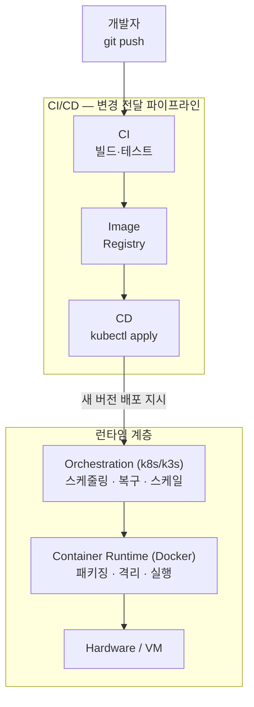

## Context

tmux의 서버 필요 여부가 배포 파이프라인 성숙도에 달려 있다는 논의에서, 컨테이너화·오케스트레이션·CI/CD 각각이 어떤 개념의 구현인지 그리고 계층 관계인지 수평 관계인지 정리하게 됐다.

## Insight

### 세 개념은 수직 계층이 아니라 서로 다른 관심사에 답한다

| 개념 | 구현 | 답하는 질문 | 관심 대상 |
|---|---|---|---|
| **컨테이너화** | Docker | "앱과 환경을 어떻게 패키징하나?" | 이미지·아티팩트 |
| **컨테이너 오케스트레이션** | k8s / k3s | "컨테이너들을 어떻게 안정적으로 계속 실행하나?" | 런타임 상태 유지 |
| **CI/CD** | GitHub Actions 등 | "새 코드를 어떻게 안전하게 프로덕션에 전달하나?" | 변경 흐름 관리 |

### CI/CD는 오케스트레이션 위의 계층이 아니라 수평으로 관통하는 파이프라인이다

컨테이너화 → 오케스트레이션은 수직 계층 관계가 맞다. 그러나 CI/CD는 그 위에 쌓이는 게 아니라, 변경이 발생할 때마다 계층들을 통과하는 파이프라인이다.

### CD와 오케스트레이션의 경계가 흐린 이유

CD가 오케스트레이터에게 일을 위임하기 때문이다. CD는 "언제, 무엇을 배포할지" 결정하고, 오케스트레이션은 "어떻게 무중단으로 교체할지" 실행한다. GitOps(Argo CD) 방식에서는 오케스트레이터가 git을 직접 감시하며 자동 적용하므로 경계가 더욱 흐려진다.

## Related

- [[Server-side tmux necessity signals incomplete container deployment pipeline]] — 이 개념 체계가 필요했던 맥락
- [[Docker - Docker Compose - Dockerfile 개념 분리]] — 컨테이너화 세부 개념
- [[Kubernetes]] — 오케스트레이션 개념
- [[Docker and Ansible over k3s until edge scale justifies HA overhead]] — 오케스트레이션 도구 선택 결정
- [[Sealing is separable from the container runtime so a self-contained bundle can replace an image]] — 이 분리를 선택적으로 채택하는 판단
