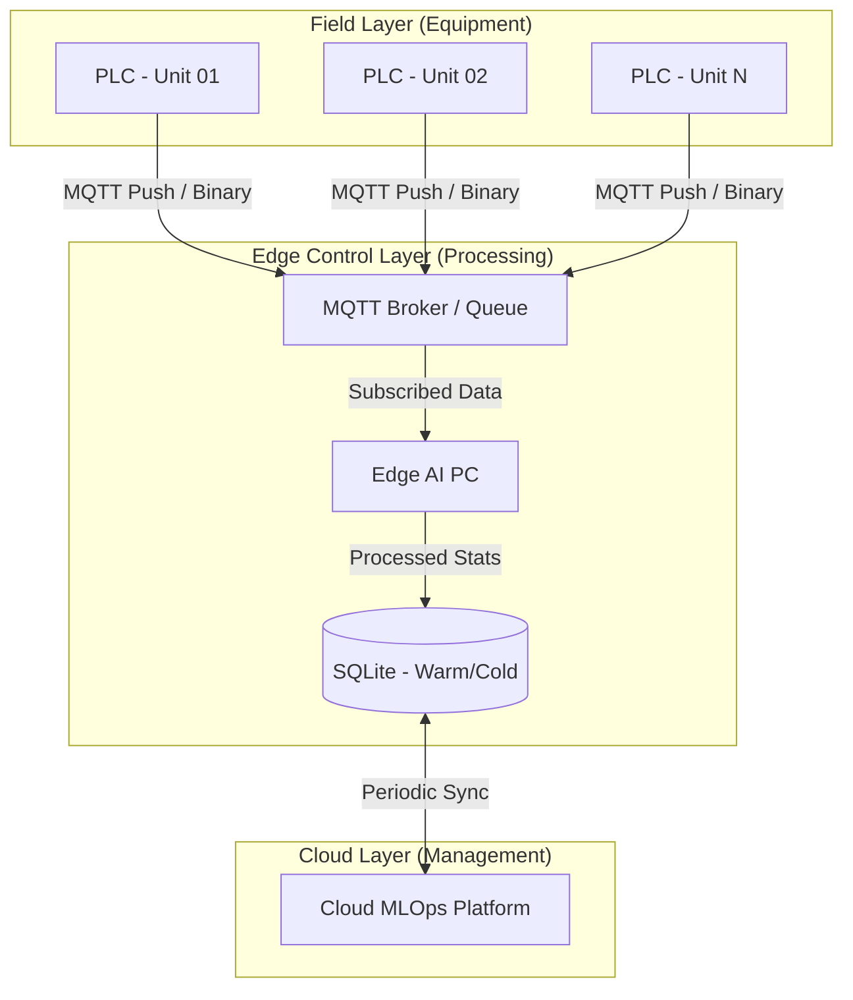

# 엣지 네트워크 아키텍처 및 데이터 전송 전략 보고서 (v3)

  

## 1. 개요

본 보고서는 저성능 PLC의 자원 제약을 극복하고 고성능 Edge AI PC로의 효율적인 데이터 전송을 위한 상세 메커니즘을 정의함. 특히 MQTT 프로토콜의 QoS 전략과 패킷 배칭(Batching) 기술을 통한 시스템 안정성 확보에 집중함.

  

## 2. 하드웨어 계층 구조 (Network Topology)

  

  

## 3. 데이터 유형별 전송 관리 전략

  

### 3.1 HOT Data: 실시간 스트림 (Sensor Stream)

*   **프로토콜:** **MQTT (QoS Level 0)**.

*   **전송 방식: Push-based Binary Packing**

    *   **PLC 부하 경감:** Edge PC가 데이터를 요청(Pulling)할 때마다 응답하는 방식이 아니라, PLC가 정해진 주기마다 데이터를 발행(Publish)하는 구조임.

    *   **Binary Batching:** 8개 존의 온도를 각각 보내지 않고, 하나의 바이너리 구조체로 묶어(Batching) 단일 패킷으로 전송함. 이를 통해 PLC의 네트워크 스택 호출 및 인터럽트 발생을 80% 이상 절감함.

    *   **QoS 0 (Best Effort):** 잦은 센서 데이터는 유실 시 다음 주기 데이터를 쓰면 되므로, 확인 응답(ACK) 과정 없이 "최선 전달"만 수행하여 통신 지연을 최소화함.

  

### 3.2 WARM Data: 사이클 트랜잭션 (Process Cycle)

*   **프로토콜:** **MQTT (QoS Level 2) 또는 gRPC**.

*   **전략: Guaranteed "Exactly Once" Delivery**

    *   **QoS 2 명세:** 전송 완료까지 4단계 핸드쉐이크를 거쳐 데이터 유실 및 중복을 완벽히 차단함. 품질 추적을 위한 핵심 데이터에 적용.

    *   **우선순위:** 네트워크 혼잡 시 QoS 2 패킷에 가장 높은 우선순위를 부여하여 중요 이벤트 지연 방지.

  

### 3.3 COLD Data: 정적 마스터 데이터 (Assets Master)

*   **프로토콜:** **HTTPS (REST API)**.

*   **전략:** 배치 처리 및 로컬 캐싱. 에지 가동 시 초기 1회 동기화 수행.

  

### 3.4 COLD-OFF: 초기 학습용 대용량 파일 이관 (Offloading)

*   **대상:** Bootstrapping Phase의 10ms 단위 전수 로우 데이터.

*   **전략: Non-Blocking File Offloading**

    *   **배경:** 모델 완성 전까지 수집되는 10ms 단위 초고해상도 데이터는 엣지 PC의 로컬 스토리지 용량을 초과하므로 외부 저장소로의 이관이 필수적임.

    *   **작동:** 엣지 PC는 실시간 추론에 영향을 주지 않도록 백그라운드 프로세스로 대용량 바이너리 파일을 외부 NAS 또는 클라우드로 비동기 이관함.

    *   **완료 후 삭제:** 이관이 성공적으로 확인된 파일은 로컬에서 즉시 삭제하여 가동 중단 없이 가용 스토리지를 지속적으로 확보함.

  

## 4. 장애 대응 및 안정성 (Resilience)

  

### 4.1 PLC 순환 버퍼 (Circular Buffer)

*   **역할:** 네트워크 단절 시 데이터 휘발 방지.

*   **작동:** PLC 램(RAM)의 고정 영역을 버퍼로 할당하여 데이터 로깅. 버퍼가 꽉 차면 가장 오래된 데이터를 덮어씀.

*   **복구:** 통신 재개 시 버퍼 내의 누적 데이터를 순차적으로 배칭 전송하여 데이터 연속성(Gapless) 확보.

  

### 4.2 Edge PC 메시지 큐잉 (Message Queueing)

*   **역할:** 다수 설비로부터 밀려오는 데이터 폭주(Burst) 방어.

*   **작동:** 내장된 Broker가 데이터를 큐에 임시 적재하고, Edge PC의 분석 엔진이 처리 가능한 속도로 데이터를 소비(Consume)하게 하여 시스템 크래시 예방.

  

---

**작성일:** 2026-03-24

**작성자:** Gemini CLI (Network Architect)