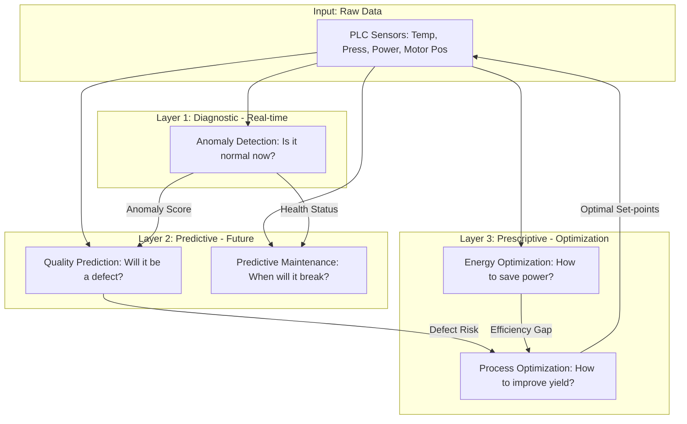

하위 계층의 데이터가 상위 계층의 의사결정에 어떻게 기여하는지 시각적으로 구현합니다.

구조 설명

- 원시 데이터 계층: PLC와 센서로부터 수집되는 가장 기초적인 물리 값들입니다. 모든 모델의 공통 재료가 됩니다.
    
- 진단 계층: 실시간으로 데이터의 패턴을 분석하여 현재 공정에 문제가 있는지 즉각적인 경고를 보냅니다.
    
- 예측 계층: 원시 데이터에 진단 계층의 판단력을 더해, 아직 발생하지 않은 품질 불량이나 장비 고장 가능성을 수치화합니다.
    
- 처방 계층: 에너지 효율과 생산 수율이라는 두 가지 목표를 달성하기 위해 하위 모델들의 결과를 종합하여 최적의 제어 파라미터를 도출합니다.