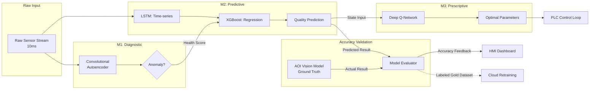

# Model Architecture (AI 모델 상세 설계)

  

## 1. 개요

본 문서는 LMR(Lens Molding Robot) 프로젝트의 핵심 엔진인 3대 AI 모델의 알고리즘 구조와 모델 간의 데이터 연쇄(Cascading), 그리고 AOI 비전 데이터를 통한 검증 로직을 시각화하여 정의함.

  

## 2. 통합 모델 및 검증 아키텍처 (Cascading & Feedback Flow)

  

데이터가 원시 스트림에서 시작하여 진단, 예측을 거쳐 최종 제어 처방으로 구체화되며, AOI 결과와 대조되어 완성되는 과정을 시각화함.

  

  

## 3. 모델별 상세 기술 명세

  

### 3.1 M1: Diagnostic (Anomaly Detection)

*   **구조:** 1D-CNN 기반의 Autoencoder.

*   **역할:** 정상 파형 대비 복원 오차 임계치 초과 시 이상 감지.

  

### 3.2 M2: Predictive (Quality Prediction)

*   **구조:** LSTM(시계열 특징)과 XGBoost(정적 변수)의 앙상블.

*   **검증:** AOI에서 판정한 실제 합/불 결과와 M2의 예측 확률을 대조하여 F1-Score 산출. **목표 정확도 85% 달성의 기준점.**

  

### 3.3 M3: Prescriptive (Process Optimizer)

*   **구조:** 가치 기반 강화학습 (Deep Q-Network).

*   **역할:** 품질 예측값과 AOI 피드백 정보를 활용하여 제어 파라미터 최적화.

  

## 4. AOI 데이터의 역할 및 연계 정책

  

1.  **Ground Truth 제공:** AOI 비전 판정 결과는 시스템 내에서 AI 모델의 성능을 판단하는 유일한 '진실'로 기능함.

2.  **데이터 라벨링(Labeling):** 전수 수집된 센서 데이터 파형에 AOI 판정 결과를 태깅하여 고품질의 학습용 **Gold Dataset** 구축.

3.  **재학습 트리거:** 실시간 정확도(`EV`)가 일정 수준 이하로 하락할 경우, 클라우드로 데이터를 전송하여 재학습을 요청하는 지표가 됨.

  

---

**작성자:** 홍승완 (AI Architect)

**최종 업데이트:** 2026-03-25