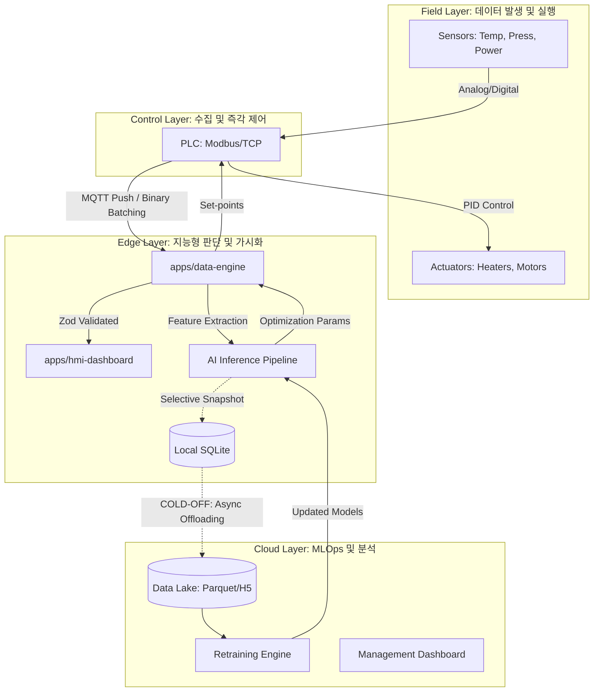

# Technical Architecture (Lv 1: Context)

  

> **Standard Name:** Technical Architecture (TA)

> **C4 Model Level:** Level 1 (System Context) / Level 2 (Container Overview)

  

## 1. 개요

본 문서는 LMR(Lens Molding Robot) 지능화 프로젝트의 전체 기술 계층과 데이터/모델/네트워크의 유기적 결합 구조를 정의함. 본 시스템은 엣지 중심의 실시간 제어와 클라우드 기반의 지속적 학습(Continual Learning)을 통합하는 것을 목표로 함.

  

## 2. 통합 기술 스택 및 계층 구조 (TA)

  

  

## 3. 핵심 서브시스템 전략

  

### 3.1 데이터 아키텍처 전략

*   **Golden Key:** 모든 데이터는 `Cycle_ID`를 중심으로 시간적/공간적(MOLD_ZONE_MAP)으로 통합됨.

*   **Persistence:** 정상 시 요약(Summary), 이상 시 전체 덤프(Anomaly Dump)를 수행하는 선별적 적재 전략 채택.

  

### 3.2 네트워크 통신 전략

*   **HOT Data:** 10ms 단위 고주파 데이터는 MQTT QoS 0(Best Effort) 및 Binary Batching을 통해 전송 부하 최소화.

*   **WARM Data:** 사이클 결과 및 알람은 gRPC/MQTT QoS 2를 통해 1회 전송 도달 보장.

  

### 3.3 AI 추론 및 성능 피드백 루프

*   **Closed-loop:** AI 예측값과 AOI 비전 실제값을 실시간 대조하여 모델 신뢰도를 상시 검증(Model Evaluator)하고 이를 HMI에 가시화함.

  

---

**작성자:** 홍승완 (System Architect)

**최종 업데이트:** 2026-03-25