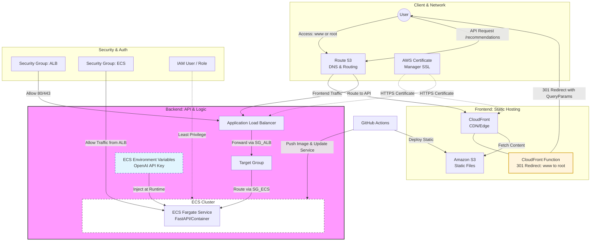

## 요약
본 시스템은 Next.js 기반의 프런트엔드와 FastAPI 기반의 백엔드로 구성된 서버리스 아키텍처입니다. AWS S3와 CloudFront를 통한 정적 호스팅과 ECS Fargate를 이용한 컨테이너 기반의 API 서비스를 결합하여 가용성과 확장성을 확보했습니다.
## 계층
### Client & Network
User: 서비스 접속자입니다.
Route 53: DNS 라우팅을 담당하며 프런트엔드 트래픽과 API 요청을 분기합니다.
AWS Certificate Manager (ACM): SSL/TLS 인증서를 관리하며 CloudFront와 ALB에 HTTPS 보안을 제공합니다.
### Frontend: Static Hosting
Amazon S3: Next.js로 빌드된 정적 자산 파일을 저장합니다.
CloudFront: 글로벌 엣지 로케이션을 통해 저지연 접속을 지원하고 데이터 캐싱을 수행합니다.
CloudFront Function: www 주소를 root로 리다이렉트 처리하며 쿼리 파라미터를 유지합니다.
### Backend: API & Logic
Application Load Balancer (ALB): 유입되는 API 요청을 수신하고 대상 그룹으로 전달합니다.
Target Group: ALB가 전달한 트래픽을 처리할 실제 대상인 ECS 서비스를 지정합니다.
ECS Cluster (Fargate Service): FastAPI 컨테이너가 실행되는 서버리스 환경으로 실제 비즈니스 로직을 처리합니다.
ECS Environment Variables: OpenAI API Key와 같은 민감 정보를 런타임 시점에 컨테이너에 주입합니다.
### Security & Auth
Security Group (ALB): 80 및 443 포트의 외부 접근을 제어합니다.
Security Group (ECS): ALB로부터 오는 트래픽만 허용하여 백엔드 보안을 강화합니다.
IAM User / Role: 최소 권한 원칙을 준수하며 GitHub Actions와 ECS 클러스터 간의 권한을 제어합니다.
## CI/CD 및 운영 관리
GitHub Actions: 소스 코드 변경 시 파이프라인이 작동합니다.
Deploy Static: S3의 정적 파일을 업데이트하여 프런트엔드를 배포합니다.
Push Image & Update Service: 새로운 컨테이너 이미지를 빌드 및 푸시하고 ECS 서비스를 업데이트합니다.
## 회고
AWS SAA 자격증을 준비하며 이론적인 아키텍처 설계에는 익숙해졌지만, 이를 서비스에 실제 적용하고픈 갈증이 있었습니다.  
이론이 실제 코드로 구현되며 기존의 웹사이트보다 UX가 증가되고, 가용성과 확장성이 확보되는 것을 보며 즐거웠습니다.
자격증, 이력서, 사이드 프로젝트 등 다른 업무들로 많은 시간을 소모하고 있지는 못 하는 현실이지만, 
시간이 날 때마다 더 좋은 아키텍처를 업데이트하며 이를 기록으로 남기고자 합니다.
소개글에 써 놓은 것과 같이 기술은 외적 가치를 창조해낼 때 비로소 생명을 얻는다고 생각합니다.  
앞으로도 가치 창조를 목적으로 효율적인 아키텍처 업데이트를 지속할 계획입니다.
감사합니다.
## 아키텍처

