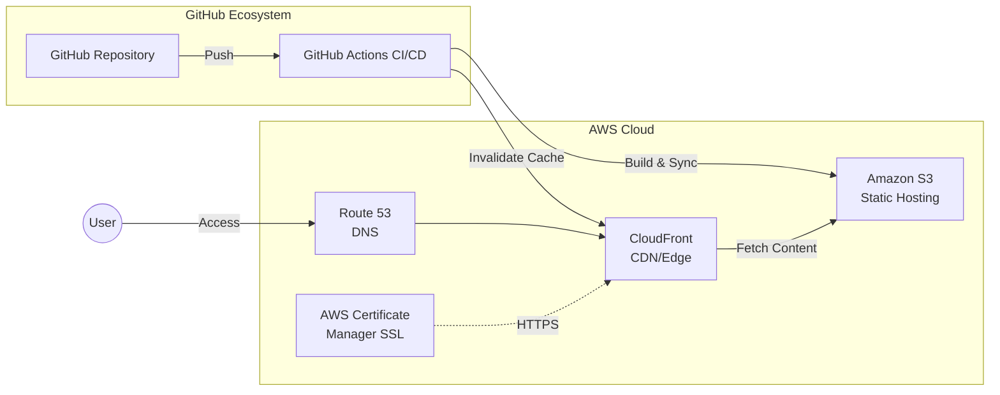
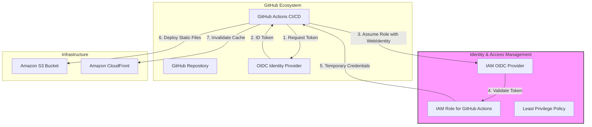
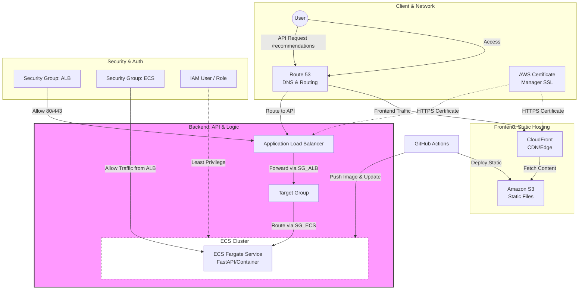
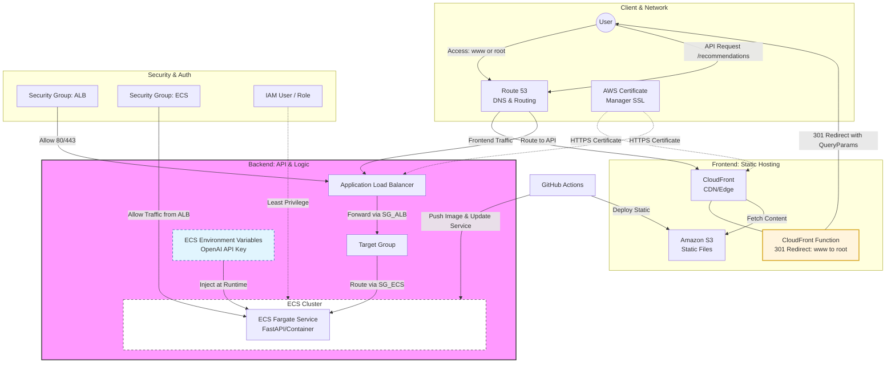

## ver 1.0

```mermaid
graph LR
    subgraph GitHub_Ecosystem [GitHub Ecosystem]
        Repo[GitHub Repository]
        Action[GitHub Actions CI/CD]
    end

    subgraph AWS_Cloud [AWS Cloud]
        S3[Amazon S3 <br/> Static Hosting]
        R53[Route 53 <br/> DNS]
        CF[CloudFront <br/> CDN/Edge]
        ACM[AWS Certificate <br/> Manager SSL]
    end

    User((User))

    %% 배포 흐름
    Repo -->|Push| Action
    Action -->|Build & Sync| S3
    Action -->|Invalidate Cache| CF

    %% 서비스 흐름
    User -->|Access| R53
    R53 --> CF
    ACM -.->|HTTPS| CF
    CF -->|Fetch Content| S3
```

## ver 1.1: IAM 추가

```mermaid
graph TD
    subgraph GitHub_Ecosystem [GitHub Ecosystem]
        Repo[GitHub Repository]
        Action[GitHub Actions CI/CD]
        OIDC_Provider[OIDC Identity Provider]
    end

    subgraph AWS_IAM [Identity & Access Management]
        IDP[IAM OIDC Provider]
        Role[IAM Role for GitHub Actions]
        Policy[Least Privilege Policy]
    end

    subgraph AWS_Resources [Infrastructure]
        S3[Amazon S3 Bucket]
        CF[Amazon CloudFront]
    end

    %% 보안 인증 흐름
    Action -->|1. Request Token| OIDC_Provider
    OIDC_Provider -->|2. ID Token| Action
    Action -->|3. Assume Role with WebIdentity| IDP
    IDP -->|4. Validate Token| Role
    Role -->|5. Temporary Credentials| Action

    %% 배포 흐름
    Action -->|6. Deploy Static Files| S3
    Action -->|7. Invalidate Cache| CF

    style AWS_IAM fill:#f9f,stroke:#333,stroke-width:2px
```

## ver 2.0: Demo Live

```mermaid
graph TD
    subgraph Client_Layer [Client & Network]
        User((User))
        R53[Route 53 <br/> DNS & Routing]
        ACM[AWS Certificate <br/> Manager SSL]
    end

    subgraph Frontend_Static [Frontend: Static Hosting]
        CF[CloudFront <br/> CDN/Edge]
        S3[Amazon S3 <br/> Static Files]
    end

    subgraph Backend_App [Backend: API & Logic]
        ALB[Application Load Balancer]
        subgraph ECS_Cluster [ECS Cluster]
            Fargate[ECS Fargate Service <br/> FastAPI/Container]
        end
        TG[Target Group]
    end

    subgraph Security_Identity [Security & Auth]
        SG_ALB[Security Group: ALB]
        SG_ECS[Security Group: ECS]
        IAM_User[IAM User / Role]
    end

    %% 네트워크 및 서비스 흐름
    User -->|Access| R53
    R53 -->|Frontend Traffic| CF
    CF -->|Fetch Content| S3
    ACM -.->|HTTPS Certificate| CF
    ACM -.->|HTTPS Certificate| ALB

    %% API 요청 흐름
    User -->|API Request /recommendations| R53
    R53 -->|Route to API| ALB
    ALB -->|Forward via SG_ALB| TG
    TG -->|Route via SG_ECS| Fargate

    %% 권한 및 보안
    IAM_User -.->|Least Privilege| ECS_Cluster
    SG_ALB -->|Allow 80/443| ALB
    SG_ECS -->|Allow Traffic from ALB| Fargate

    %% CI/CD 연결 (기존 유지)
    Action[GitHub Actions] -->|Deploy Static| S3
    Action -->|Push Image & Update| ECS_Cluster

    style Backend_App fill:#f9f,stroke:#333,stroke-width:2px
    style ECS_Cluster fill:#fff,stroke:#333,stroke-dasharray: 5 5
```
## ver 2.1: www 우회 및 suspend 정적 도메인 로드

```mermaid
graph TD
    subgraph Client_Layer [Client & Network]
        User((User))
        R53[Route 53 <br/> DNS & Routing]
        ACM[AWS Certificate <br/> Manager SSL]
    end

    subgraph Frontend_Static [Frontend: Static Hosting]
        CF[CloudFront <br/> CDN/Edge]
        CFF[CloudFront Function <br/> 301 Redirect: www to root]
        S3[Amazon S3 <br/> Static Files]
    end

    subgraph Backend_App [Backend: API & Logic]
        ALB[Application Load Balancer]
        subgraph ECS_Cluster [ECS Cluster]
            Fargate[ECS Fargate Service <br/> FastAPI/Container]
        end
        TG[Target Group]
        Secrets[ECS Environment Variables <br/> OpenAI API Key]
    end

    subgraph Security_Identity [Security & Auth]
        SG_ALB[Security Group: ALB]
        SG_ECS[Security Group: ECS]
        IAM_User[IAM User / Role]
    end

    %% 네트워크 및 서비스 흐름
    User -->|Access: www or root| R53
    R53 -->|Frontend Traffic| CF
    CF --- CFF
    CFF -->|301 Redirect with QueryParams| User
    CF -->|Fetch Content| S3
    ACM -.->|HTTPS Certificate| CF
    ACM -.->|HTTPS Certificate| ALB

    %% API 요청 흐름
    User -->|API Request /recommendations| R53
    R53 -->|Route to API| ALB
    ALB -->|Forward via SG_ALB| TG
    TG -->|Route via SG_ECS| Fargate
    
    %% 데이터/보안 흐름 업데이트
    Secrets -->|Inject at Runtime| Fargate

    %% 권한 및 보안
    IAM_User -.->|Least Privilege| ECS_Cluster
    SG_ALB -->|Allow 80/443| ALB
    SG_ECS -->|Allow Traffic from ALB| Fargate

    %% CI/CD 연결
    Action[GitHub Actions] -->|Deploy Static| S3
    Action -->|Push Image & Update Service| ECS_Cluster

    style Backend_App fill:#f9f,stroke:#333,stroke-width:2px
    style ECS_Cluster fill:#fff,stroke:#333,stroke-dasharray: 5 5
    style CFF fill:#fff4dd,stroke:#d4a017,stroke-width:2px
    style Secrets fill:#e1f5fe,stroke:#01579b,stroke-dasharray: 5 5
```
