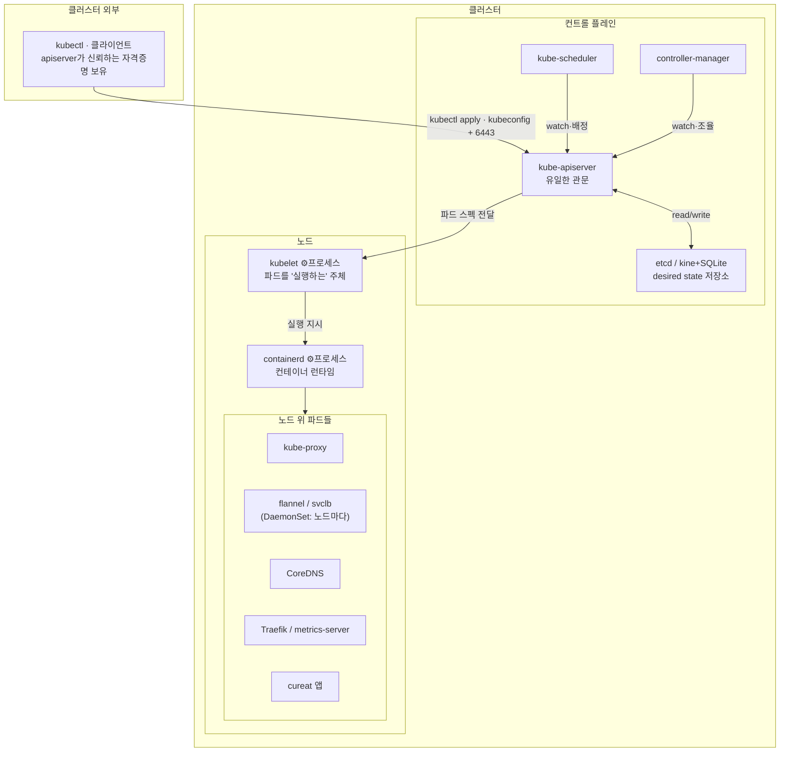

## Context
hosugator의 cureat 데모를 Oracle k3s에 배포하는 동안 apiserver·scheduler·controller-manager·kubelet·kube-proxy·etcd/kine·CoreDNS·svclb 같은 용어가 계속 쏟아졌는데, 각각이 클러스터 어디에 속하는지 지도가 머리에 없어 혼란스러웠다. 
세 평면으로 나누고, 클러스터 경계·클라이언트 자격증명·실행 형태까지 구분하니 자리가 잡혔다.

## Insight
### 클러스터 경계: 컨트롤 플레인+노드는 안, 클라이언트는 밖

### 클라이언트는 apiserver가 신뢰하는 자격증명을 가진 외부 주체다

kubectl이 명령을 보내려면 클러스터 멤버십이 아니라, apiserver가 신뢰하는 자격증명만 있으면 된다:

- 인증서 방식(우리 k3s admin): 클러스터 CA(컨트롤 플레인)가 서명한 클라이언트 인증서.
- OIDC 방식: 외부 IdP가 발급한 단기 토큰 — 컨트롤 플레인이 준 게 아니라, apiserver가 "신뢰하도록 설정된 발급자"의 것이면 수용.

> "컨트롤 플레인이 자격증명을 나눠준다"가 아니라 "apiserver가 검증할 수 있는 자격증명을 가진 자면 클라이언트". 자격증명(kubeconfig)만 있으면 노트북·CI·다른 서버 어디든 클라이언트가 된다.

### 각 역할은 프로세스 또는 파드로 실행된다

| 역할                                                | 표준 k8s 실행 형태                       | k3s          |
| ------------------------------------------------- | ---------------------------------- | ------------ |
| kubelet                                           | 프로세스 (호스트 systemd)                 | k3s 프로세스에 융합 |
| container runtime (containerd)                    | 프로세스                               | 융합           |
| apiserver / scheduler / controller-manager / etcd | static 파드 (kubeadm) · 관리형은 숨김(EKS) | 융합           |
| kube-proxy                                        | 파드 (DaemonSet)                     | 융합           |
| CNI(flannel)                                      | 파드 (DaemonSet, 노드마다)               | 융합           |
| svclb / CoreDNS / metrics-server / Traefik        | 파드 (DaemonSet 또는 Deployment)       | 파드           |
| 앱 (cureat)                                        | 파드                                 | 파드           |

> 핵심 경계: kubelet과 런타임은 파드를 "실행하는" 주체라 그 자신은 파드가 될 수 없다(=프로세스). 나머지 대부분은 그 위에서 파드로 돈다.

### 컨트롤 플레인은 desired state를 저장·조율하는 두뇌다

| 컴포넌트                     | 역할                                                             |
| ------------------------ | -------------------------------------------------------------- |
| kube-apiserver           | 모든 요청의 유일한 관문. 인증(kubeconfig)·인가(RBAC)·검증 후 datastore 읽기/쓰기    |
| etcd (k3s: kine+SQLite)  | desired state 저장소 = 클러스터 진실의 원본                                |
| kube-scheduler           | 새 파드를 어느 노드에 놓을지 결정                                            |
| kube-controller-manager  | Deployment·ReplicaSet·Node·Job 등 컨트롤러 묶음. desired↔actual 조율 루프 |
| cloud-controller-manager | 클라우드 연동(LB·노드·볼륨). 매니지드/클라우드에서만                                |

### 애드온은 별도 평면이 아니라 노드 위의 파드다

애드온(CoreDNS·CNI·Ingress·metrics 등)은 컨트롤 플레인·노드와 나란한 제3의 존재가 아니라, 노드 위에서 도는 파드다. 앱 파드와 똑같이 노드 하드웨어에서 돌고 컨트롤 플레인이 스케줄링·관리한다.

- "코어 아님"의 의미: k8s 핵심 바이너리(apiserver·kubelet 등)가 아니라 위에 얹는 선택적 구성요소. 원리상 없이도 뜨지만(단 CNI 없으면 파드 네트워킹 불가라 사실상 필수), 실사용엔 대개 설치.
- "단일 존재"는 부정확: Deployment형(CoreDNS 1~2, metrics, Traefik)은 소수 파드, DaemonSet형(CNI·kube-proxy·svclb)은 노드마다 1개.

### k3s는 프로세스·컨트롤플레인·kube-proxy·flannel을 단일 바이너리로 융합한다 — 그래서 파드로 안 보인다

표준 k8s(kubeadm)는 apiserver·scheduler·controller-manager를 각각 static 파드로 띄워 `get pods`에 다 보인다.
k3s는 프로세스류(kubelet·containerd) + 컨트롤 플레인 + kube-proxy + flannel을 하나의 `k3s` 프로세스에 융합한다. 그래서 `systemctl status k3s` 하나에 다 들어있고 파드 목록엔 안 나온다. 

## Related
- [[k8s core components each have a single responsibility across control and data planes]] — 자매 노트. 이 지도의 kube-proxy/kubelet 네트워크 라우팅 책임을 더 깊게 다룸.
- [[hosugator - infra - oracle k3s rebuild log]] — 이 개념을 만난 실제 배포 작업.
- [[Kubernetes Service types layer on top of each other from ClusterIP to LoadBalancer]] — kube-proxy가 실현하는 Service 계층.
- [[Kubernetes Service L4 boundary prevents HTTP path and header routing without Ingress]] — Ingress(Traefik)가 애드온인 이유.
- [[Worker node provides compute but job submission only requires kubeconfig not cluster membership]] — 클라이언트가 노드 멤버십과 무관한 이유.
- [[Pod resource exhaustion is handled by kubelet and probes not by Service]] — kubelet의 책임 경계.
- [[k3d wraps k3s nodes in Docker containers enabling disposable local clusters]] — 로컬에서 노드를 만드는 도구.
