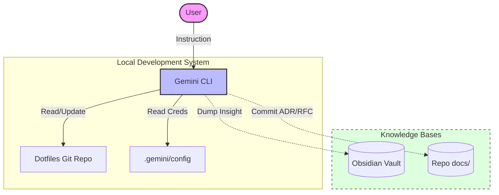

# Hybrid PKM & Intelligent Infrastructure Design

## Context
사용자의 분산된 지식과 터미널 환경 설정을 통합하고, 프로젝트 컨텍스트를 영구적인 지식 자산으로 승화하기 위한 통합 인프라를 설계함.

## Architecture Visualization (C4 L2)

## Key Decisions
1. **Logic/Data Separation**: ~/dotfiles를 통한 지능형 로직(Skills, Agents)의 버전 관리와 기기별 인증 데이터의 격리.
2. **Dual-Path Documentation**: 사람이 읽기 쉬운 Obsidian(Human-centric)과 시간순 정렬 및 단계별 정리가 용이한 Repo Docs(Process-centric)의 공존.
3. **Automated Indexing**: obsidian-helper를 통한 MOC-Inbox 자동 업데이트 및 요약문 인덱싱.

## Outcomes
- **Efficiency**: 단축키(Alias)와 자동화된 지식 덤프를 통한 작업 속도 향상.
- **Sustainability**: Git 동기화를 통한 하드웨어 독립적인 작업 환경 구축.