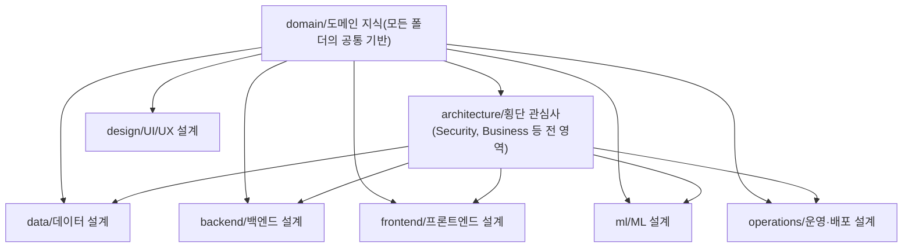

# 소프트웨어 프로젝트 문서 계층 구조

## 폴더 구분 기준

> "누가 쓰고 누가 읽는가"

폴더를 기술 스택이나 레이어가 아닌 **독자와 작성자의 역할**로 구분한다. 이렇게 하면 "이 문서는 어느 폴더에 넣어야 하나?"라는 판단이 명확해진다.

## 계층 흐름

의존 방향: 아래 폴더일수록 위 폴더를 참조한다.



### architecture/ 폴더의 범위

architecture/ 폴더는 **횡단 관심사(cross-cutting concerns)만** 담는다. 예: 보안 정책, 비즈니스 규칙, 인증/인가 전략, 공통 에러 처리 방식.

각 영역(data, backend, frontend 등)의 아키텍처 문서는 해당 폴더의 `00_Overview.md`에 위치시킨다. architecture/ 폴더에 모아두지 않는다.

## 프로세스 문서 3종

| 폴더 | 목적 | 삭제 가능 여부 |
|------|------|--------------|
| `adr/` | 영구 결정 기록 | 삭제 금지 (superseded로 표시) |
| `plans/` | 구현 전 계획서 | 보존 권장 |
| `reports/` | 구현 후 결과서 | 보존 권장 |

plans와 reports는 동일 키워드로 짝을 맞춘다.

```
plans/20260330-P1-modbus-foundation.md
reports/20260330-P1-modbus-foundation.md
```

## Phase DoD 패턴 (Definition of Done)

Phase는 **시간이 아니라 완료 조건 충족**으로 전환한다.

- 각 plans 문서에 DoD 체크리스트를 명시한다.
- Phase가 완료되려면 체크리스트의 모든 항목이 충족되어야 한다.
- 일정이 밀리더라도 DoD 미충족 상태에서 다음 Phase로 넘어가지 않는다.

```markdown
## Definition of Done
- [ ] Modbus TCP 연결 및 해제 구현
- [ ] 단위 테스트 커버리지 80% 이상
- [ ] ADR 작성 완료
```

## 00_MOC.md 패턴

각 폴더에 목차 문서(`00_MOC.md` 또는 `00_Overview.md`)를 둔다.

포함 내용:
1. 이 폴더의 목적
2. 문서 목록 및 각 문서의 한 줄 요약
3. 타 폴더와의 관계 (어디서 왔고, 어디로 가는가)

이 문서가 있으면 신규 팀원이 폴더 진입 시 탐색 비용을 최소화할 수 있다.

## 관련 노트

- [[Version control the Docs as Code]] — 이 구조를 지탱하는 파일명 불변, frontmatter 필수 등의 기반 원칙
- [[ADR should have status, context, decisions and consequences]] — adr/ 폴더에서 사용하는 문서 패턴의 상세
