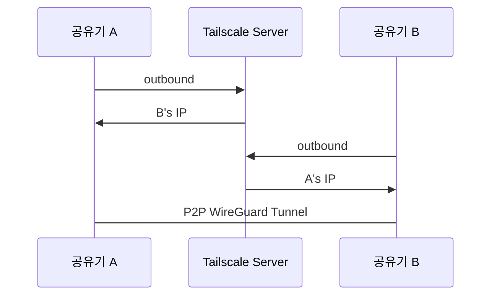

## Context
k3s 멀티노드 클러스터를 맥북과 회사 PC 사이에 Tailscale로 연결하면서 "Tailscale이 왜 무료로 운영 가능한가", "인바운드 차단을 어떻게 우회하는가"라는 질문에서 실제 메커니즘을 처음 깊이 이해했다.

## Insight
### Tailscale 서버는 초기 핸드셰이크만 중재하고 실제 트래픽은 기기 간 직접 흐른다

방화벽과 NAT은 inbound(외부→내부)를 차단하고 outbound(내부→외부)는 허용한다. Tailscale은 이 비대칭성을 이용해 양쪽이 먼저 outbound를 열어 서로의 위치를 파악한 뒤 직접 연결한다.

**NAT hole punching 메커니즘:**



양쪽이 **동시에** outbound 패킷을 보내면, 각 공유기는 "내가 먼저 저쪽으로 나간 기록이 있으니 응답"으로 간주해 inbound를 통과시킨다.

### Tailscale IP(100.x.x.x)는 공인 IP가 아닌 CGNAT 예약 대역이다

```
CGNAT 대역: 100.64.0.0/10 (RFC 6598 예약)
```

수치상 공인 IP 범위 안에 있지만 인터넷에서 라우팅되지 않는 예약 구간이다. 실제 트래픽은 각 기기의 공인 IP를 통해 이동하되, WireGuard 암호화 터널 안에 캡슐화된다.

### keepalive는 각 기기의 데몬이 직접 수행해 Tailscale 서버 부하를 최소화한다

각 기기에 설치된 `tailscaled` 데몬이 주기적으로 상대 기기에 직접 keepalive 패킷을 보내 NAT hole을 유지한다. Tailscale 서버를 거치지 않으므로 서버 부하가 낮다. 이것이 무료 운영이 가능한 이유다.

P2P가 불가능할 때만 DERP 릴레이 서버를 fallback으로 사용하며, 이 릴레이 비용이 Tailscale의 실제 운영 원가다.

## Related
- [[Tailscale over port forwarding when corporate firewall blocks inbound SSH]] — Tailscale 선택 결정과 실용적 설정
