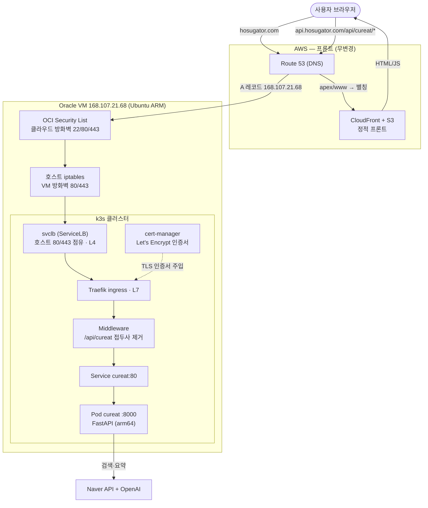
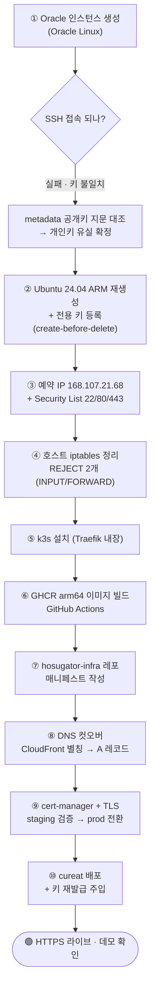
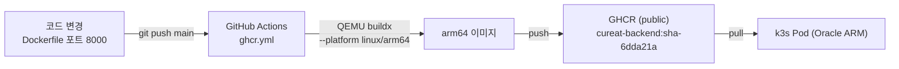
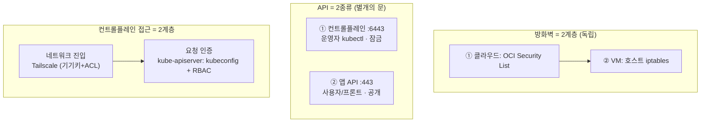

# Oracle Always Free k3s 재구축 실행 로그 (2026-07-06)

철거된 AWS EC2 k3s([[hosugator - infra - k8s - plan]])를 Oracle Always Free(ARM)로 재이식하는 작업의 상세 기록. 결정 배경은 [[Oracle free tier ARM k3s over paid AWS for demo hosting until traffic justifies managed infra]] 참조.

## 현재 상태 — 🟢 cureat 라이브 (2026-07-07 완료)

**`https://api.hosugator.com/api/cureat/recommendations/v2` 실동작 확인.** 프론트(hosugator.com) 데모 모달 브라우저 검증까지 성공.

- **노드**: `hosugator-k3s` **Ready**, k3s **v1.36.2+k3s1**, arm64
- **시스템 파드**: CoreDNS / local-path-provisioner / metrics-server / **Traefik + svclb** 전부 Running
- **TLS**: cert-manager v1.20.3 + Let's Encrypt **prod** 인증서 (90일 자동 갱신). staging으로 먼저 검증 후 prod 전환.
- **전체 경로 (검증됨)**: `인터넷 → Route53(api A → 168.107.21.68) → OCI Security List(80/443) → 호스트 iptables → svclb → Traefik → Middleware(/api/cureat prefix strip) → cureat 파드 → Naver+OpenAI`
- **cureat**: GHCR `ghcr.io/hosugator/cureat-backend:sha-6dda21a` (arm64, public), 포트 8000, Secret은 재발급 키로 주입 완료.

## 다이어그램 (내일 리뷰용)

### ① 최종 런타임 아키텍처 — 요청이 흐르는 경로



### ② 오늘의 작업 순서 (실제 밟은 경로)



### ③ 이미지 CI/CD 파이프라인



### ④ 계층 개념 모델 (오늘 정리한 것)



## 수행 내역 (시간순 + WHY)

### 1. 인스턴스 프로비저닝과 SSH 키 분실 사건
- 최초 인스턴스(`instance-20260706-0645`, Oracle Linux 9)는 접속이 안 됐다. 맥북의 키 3개(`go2fit-arm.key`, `go2fit.key`, `ssh-key-2026-07-05.key`)가 전부 `Permission denied (publickey)`.
- **진단 방법**: `ssh -v`로 키 제시→거부 확인(단순 불일치). 그 뒤 **Cloud Shell에서 인스턴스 metadata의 `ssh_authorized_keys`를 직접 조회**해 인스턴스가 요구하는 공개키 원문을 확보 → 지문 대조:
  - 인스턴스 요구 키: `SHA256:y2cWG6W80wsJ...` (2048 RSA)
  - 보유 키들: 어느 것도 불일치 (`o0g3...` 등)
- **원인**: OCI가 생성 키를 날짜로만 명명(`ssh-key-2026-07-05`)해, 같은 날 두 번 생성 시 이름이 겹침. 23:08 세션에서는 **공개키만 저장하고 개인키를 안 챙김** → 그 개인키로 만들어진 이 인스턴스에 영영 못 들어감. (06:46 다운로드분은 실은 go2fit-arm 인스턴스 키였음)
- **교훈**: 인스턴스가 실제로 신뢰하는 키는 콘솔 UI엔 안 보이지만 **metadata API로 확인 가능**하다. 지문 대조가 추측보다 빠르고 확실.

### 2. Ubuntu로 재생성 결정
- 키 복구 불가 → 재생성 불가피. **재생성을 어차피 하므로**, Oracle Linux를 고수할 이유(=재생성 회피)가 사라짐. SELinux 마찰이 없는 **Ubuntu 24.04 ARM**을 택함. (Serial console 복구는 SELinux 컨텍스트 문제로 오히려 더 위험하다고 판단)
- **create-before-delete**로 진행: 잠긴 인스턴스를 켜둔 채 새것 생성(용량 상실 방어). A1 용량은 문제없이 확보됨.

### 3. 전용 SSH 키 생성·등록
- gigabyte 개발 머신에서 전용 ed25519 키 생성: `~/.ssh/oracle_hosugator`(개인) / `.pub`(공개).
- 새 인스턴스 생성 화면에서 **`oracle_hosugator.pub` 업로드**로 등록(붙여넣기 대비 오타 위험 0).
- **WHY 전용 키**: 프로젝트/기기별 키 분리 → 나중에 특정 기기 접근만 취소하기 쉬움.

### 4. 네트워킹
- **예약(Reserved) 공인 IP `168.107.21.68`**(`hosugator-api-ip`) 할당. WHY: 곧 `api.hosugator.com`이 가리킬 주소라 stop/start에도 안 바뀌는 고정 IP 필요. (Ephemeral은 재시작 시 변동)
- **Security List(클라우드 방화벽)** Ingress에 **22/80/443 stateful** 추가. WHY stateful: 응답 트래픽 자동 허용, stateless와 혼용 시 꼬임 방지.
- 옛 잠긴 인스턴스 **terminate(부트 볼륨 삭제 포함)** → 리소스·잠재 과금 정리 + 예약 IP 회수.
- 예약 IP를 새 인스턴스 VNIC로 이전. UI 함정: ephemeral이 슬롯을 점유 중이면 Reserved 옵션이 안 보임 → **No public IP로 Update(떼기) 후 다시 Reserved 붙이기** 2단계.

### 5. 호스트 방화벽(iptables) — Oracle Ubuntu 이미지의 함정
- Oracle Ubuntu 이미지는 `iptables-persistent`로 **재부팅에도 유지되는 REJECT 규칙 2개**를 내장:
  - `INPUT` 끝의 `REJECT`: 22 외 신규 인바운드 전부 차단 → 80/443 막힘
  - `FORWARD` 맨 앞의 `REJECT`: k3s pod 네트워킹(flannel FORWARD 라우팅) 파괴
- **조치**:
  - `INPUT`에 80/443 ACCEPT를 REJECT **앞에** 삽입
  - `FORWARD` REJECT 규칙을 스펙으로 명시 삭제
  - `netfilter-persistent save`로 영속화 — **k3s 설치 *전*에** 저장(깨끗한 base만 굳히고, k3s 동적 규칙이 섞이지 않게)

### 6. k3s 설치
```
curl -sfL https://get.k3s.io | \
  INSTALL_K3S_EXEC="--write-kubeconfig-mode 644 --tls-san 168.107.21.68" sh -
```
- `--write-kubeconfig-mode 644`: `ubuntu` 유저가 `sudo` 없이 kubeconfig 읽기(기본 600은 root 전용).
- `--tls-san 168.107.21.68`: API 서버 인증서 SAN에 공인 IP 추가 → 추후 원격 kubectl 대비. 최종 IP 확정 상태에서 넣어 재발급 불필요.
- Traefik ingress는 k3s 기본 포함 → 별도 프록시 설치 불필요.
- 설치 후 Traefik은 `helm-install-traefik` job으로 배포되어 1분가량 뒤 svclb와 함께 80/443 점유.

## 핵심 정보 (SSOT)

| 항목 | 값 |
|---|---|
| 인스턴스 | `hosugator-k3s` (ap-chuncheon-1, AD-1) |
| Shape / OS | VM.Standard.A1.Flex, 2 OCPU / 12GB, Ubuntu 24.04 aarch64 |
| 공인 IP (예약) | **168.107.21.68** (`hosugator-api-ip`) |
| 사설 IP | 10.0.0.209 |
| 접속 유저 | `ubuntu` |
| SSH 개인키 (gigabyte) | `~/.ssh/oracle_hosugator` |
| k3s | v1.36.2+k3s1, kubeconfig `/etc/rancher/k3s/k3s.yaml` (mode 644) |
| VCN / Subnet | vcn-20260706-0646 / subnet-20260706-0646 |
| 열린 포트 (2계층) | 22, 80, 443 (Security List + 호스트 iptables) |

## 완료된 작업 (모두 ✅)

1. ✅ 노출 시크릿 재발급 (OpenAI/Naver) → k8s Secret 주입 (더미로 경로 검증 후 실제 키 교체 + `rollout restart`).
2. ✅ `hosugator-infra` 레포 생성 (GitOps-ready: `cluster/cert-manager/` + `apps/cureat/`). — 로컬, 원격 push는 미정.
3. ✅ DNS 컷오버: `api.hosugator.com` CloudFront 별칭 → A레코드 `168.107.21.68`.
4. ✅ cert-manager v1.20.3 + ClusterIssuer(staging→prod) HTTP-01.
5. ✅ cureat 배포: Deployment/Service/Middleware/Ingress + Secret.

## 남은 작업 (선택, 향후 세션)

- `hosugator-infra` 레포 **GitHub 원격 생성 + push** (현재 로컬 커밋만).
- **Tailscale 신원 매핑** 모듈 (포트폴리오용 — control plane 접근을 zero-trust로). [[Argo CD is a deployment coordinator not a runtime dependency, k3s self-heals without it]] 계열 학습.
- Always Free **reclaim 방지 keep-alive**.
- `apt upgrade` (보안 업데이트) + 필요시 재부팅.
- cureat 요약 품질 확인 — 응답 요약이 템플릿틱, OpenAI 호출이 fallback인지 파드 로그로 점검 (앱 로직, 인프라 무관).

## 겪은 함정 / 교훈

- **OCI 키 명명 충돌**: 날짜만으로 이름 지어 같은 날 두 키가 충돌. 다운로드 시 개인키·공개키를 **둘 다** 저장하고 즉시 리네이밍할 것. 신뢰 키는 metadata로 확인 가능.
- **비용 견적 도구는 Free Tier를 반영하지 않는다** — 항상 정가 표시("does not reflect any tier unit pricing"). 실제 청구는 **Cost Analysis**로 확인.
- **VPU(볼륨 성능) free 여부 불명** — Oracle Free Tier 문서에 VPU 항목이 별도 명시돼 있지 않음. 실측(Cost Analysis)으로 확인해야 하고, VPU는 살아있는 볼륨에서 나중에 조정 가능(재생성 불필요).
- **Oracle 이미지 2계층 방화벽**: Security List만 열면 호스트 iptables에서 또 막힌다. 배포판(OL/Ubuntu) 무관한 Oracle 이미지 공통 특성.
- **Ubuntu 선택은 SELinux 마찰 회피** — k3s 브링업이 매끄럽다.

## Related
- [[Oracle free tier ARM k3s over paid AWS for demo hosting until traffic justifies managed infra]] — 이 작업의 결정 근거.
- [[hosugator - infra - k8s - plan]] — 철거된 AWS EC2 k3s 구축 로그(전신).
- [[Kubernetes Service L4 boundary prevents HTTP path and header routing without Ingress]] — Traefik ingress 라우팅 근거.
- [[traefik 보안 경고]] — Traefik 운영 주의.
- [[GHCR over Docker Hub until external distribution is needed]] — 다음 단계(이미지 레지스트리) 근거.
