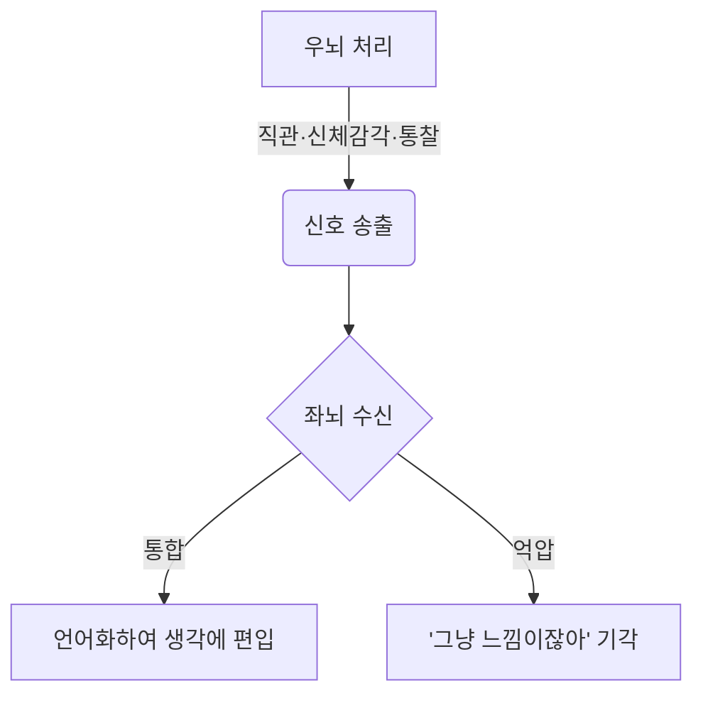
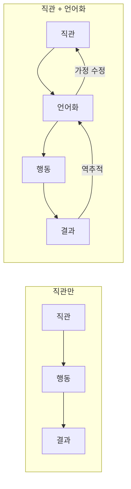
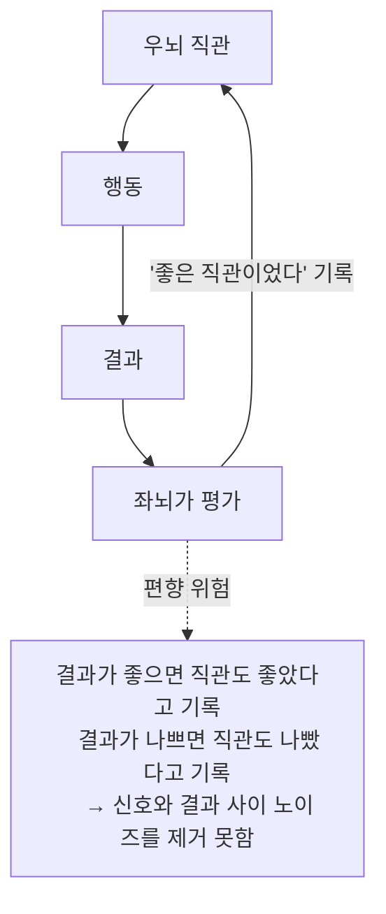
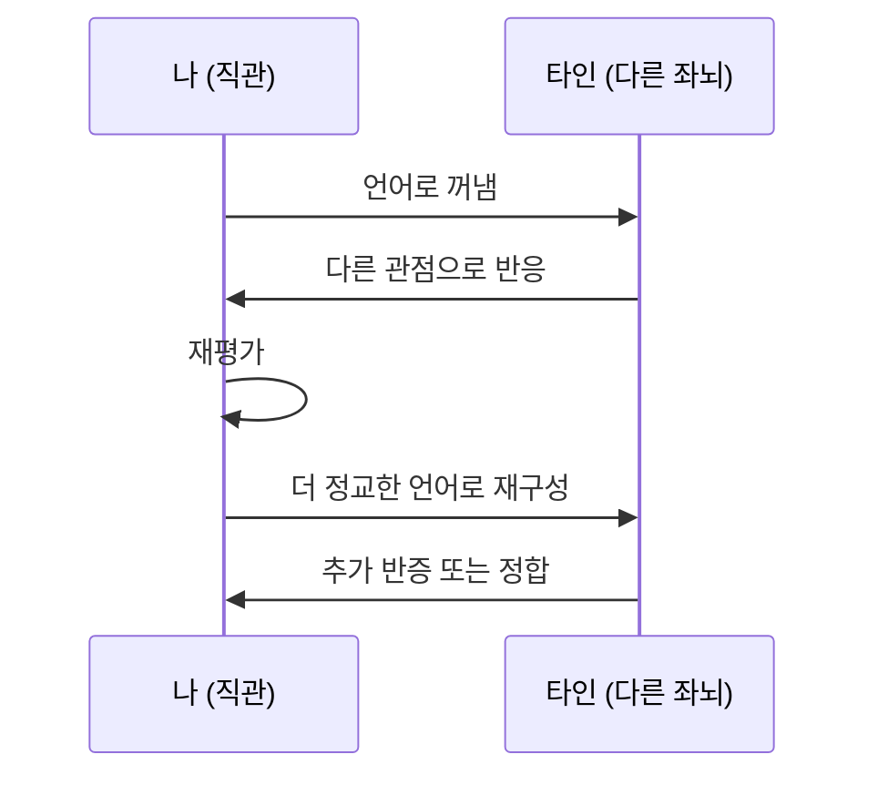

# 뇌의 해석기 구조와 직관의 인식론

> "우리는 근거가 없는 결정을 배척하지만, 실은 그러한 결정이야말로 언어화된 근거의 주춧돌이다."

## 1. 좌뇌의 해석기 (The Interpreter)

좌뇌는 언어를 담당하며, 세계를 이미 알고 있는 범주로 분류하고 일관된 서사를 만든다.
이 과정에서 모순을 무시하거나 사후 이유를 덧붙이는 **부정확한 해석기**로 동작한다.
결과적으로 "자아"라는 감각은 이 해석기가 만들어낸 내러티브의 산물일 수 있다.

## 2. 우뇌의 역할 — 언어 이전의 신호

우뇌는 직접 말을 걸지 않는다. **언어 이전의 신호**로 생각에 침투한다.

| 채널           | 내용                                   |
| ------------ | ------------------------------------ |
| **직관**       | 결론이 이유보다 먼저 온다. 느낌 → 사후 언어화 순서       |
| **통찰 (Aha)** | 우뇌가 먼저 풀고, 좌뇌가 받아 언어화 (의식보다 0.3초 앞섬) |
| **전언어적 감각**  | "말하려는데 단어가 없는" 상태. 느낌의 덩어리가 먼저 존재    |
| **신체 감각**    | 결정 전 심박·긴장 등 신체 반응. 좌뇌 추론에 배경 색채를 입힘 |
| **꿈·멍때리기**   | 좌뇌 검열이 약해질 때 우뇌식 연결이 전면에 나옴          |

## 3. 직관과 언어화 — 결과의 차이

직관에 따른 행동과 언어화된 이유에 따른 행동은 **결과적으로 큰 차이가 없을 수 있다.**
언어는 결정을 생성하지 않고, 포장한다.

> **Verbal Overshadowing**: 목격자가 용의자 얼굴을 말로 설명하면 나중에 인식이 오히려 나빠진다.
> 언어가 비언어적 기억을 덮어쓴다. (Timothy Wilson 연구 참고)

### 진짜 차이: 재현성이 아니라 반증 가능성

언어화의 핵심 기능은 공유가 아니라 **피드백 루프를 닫는 것**이다.
틀렸을 때 왜 틀렸는지 추적할 수 있어야 직관이 보정된다.

## 4. 역설 — 직관을 평가하는 것도 좌뇌다

좌뇌가 심판이면서 선수인 구조.

닫힌 루프에서는 구조적으로 자기기만이 발생한다.

## 5. 탈출구 — 타인의 좌뇌

내 좌뇌의 편향을 교정할 수 있는 두 가지 경로.

1. **반복과 통계** — 수천 번의 피드백으로 좌뇌의 서사 조작을 압도. 전문가 직관이 정교해지는 메커니즘.
2. **타인의 좌뇌** — 내 닫힌 루프와 다른 닫힌 루프를 충돌시켜 서로의 편향을 깎는다.

## 6. 메타 문제 — 평가에 대한 평가의 무한 후퇴

타인의 평가도 그 타인의 좌뇌로 이루어진다. 집단도 집단적 편향이 있다.
이는 인식론의 고전 문제인 **정당화의 무한 후퇴**와 닿는다.

인간이 선택한 현실적 탈출구:

| 전략 | 내용 | 한계 |
|---|---|---|
| **권위** | 어딘가에서 멈추고 믿는다 | 권위 자체의 편향 |
| **정합성** | 서로 모순 없이 맞물리면 수용 (과학) | 패러다임 내부의 맹점 |
| **실용** | 작동하면 된다, 진리는 묻지 않는다 | 단기 작동 ≠ 장기 진리 |

현실적 채택: **정합성 + 실용의 혼합**.

## 7. 대화의 구조적 의미

혼자 생각하는 것: 좌뇌가 우뇌를 해석하는 **닫힌 루프**.

대화: 서로의 닫힌 루프를 충돌시켜 **편향이 가중되는 속도를 늦추는 과정**.

> 철학, 과학, 그리고 좋은 대화가 존재하는 이유.
> 진리에 도달하려는 게 아니라 — 편향의 가중 속도를 늦추는 것.
> 그게 인간이 할 수 있는 현실적 최선에 가깝다.

## 참고 개념

- Michael Gazzaniga — 좌뇌 해석기 (split-brain 연구)
- Iain McGilchrist — *The Master and His Emissary* (우뇌가 주인이어야 한다)
- Antonio Damasio — Somatic Marker Hypothesis
- Mark Jung-Beeman & John Kounios — 통찰의 신경과학 (Aha moment 연구)
- Timothy Wilson — Verbal Overshadowing, 내성의 환상
