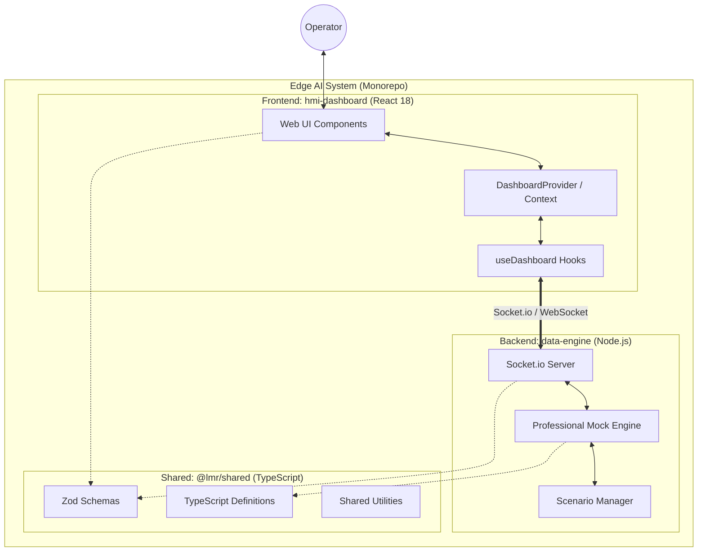
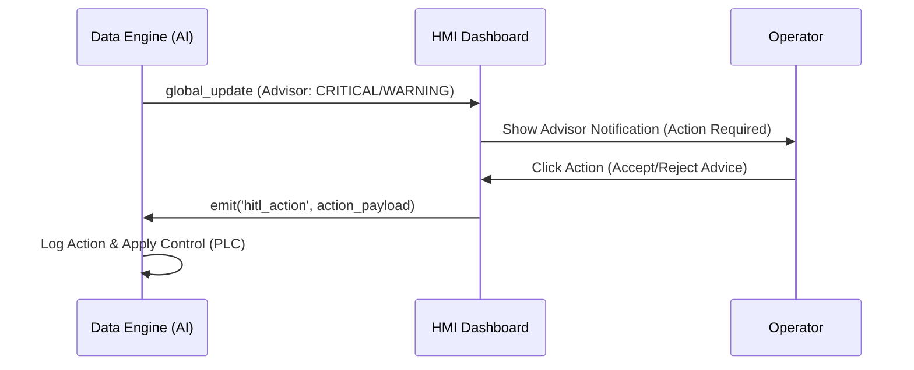

# 시스템 아키텍처 및 데이터 흐름 (Level 2: Container)

## 1. 개요
본 문서는 `ai-lmr` 프로젝트의 주요 컨테이너 간 상호작용과 실시간 데이터 스트리밍 메커니즘을 정의한다. 본 시스템은 엣지 환경에서의 실시간 모니터링과 AI 기반 의사결정 지원(HITL)을 목적으로 설계되었다.

## 2. 시스템 아키텍처 (C4 Level 2: Container Diagram)

## 3. 주요 컨테이너 역할 정의

### 3.1 Frontend: `hmi-dashboard`
- **역할**: 운영자에게 실시간 공정 상태 및 AI 분석 결과를 시각화하여 제공한다.
- **주요 구성**:
    - **DashboardProvider (Context)**: 어플리케이션 전역에서 Socket.io 연결을 단일화(Singleton)하여 관리하며, 실시간 데이터를 상태(State)로 유지한다.
    - **Monitoring Cards**: `EnergyCard`, `AnomalyCard`, `ProcessCard`, `QualityCard` 등 도메인별 핵심 지표를 독립적으로 렌더링한다.
    - **AdvisorNotification**: AI 모델의 권고 사항을 사용자에게 알리고 피드백을 수집하는 HITL 인터페이스 역할을 수행한다.

### 3.2 Backend: `data-engine`
- **역할**: 실제 설비(PLC) 또는 시뮬레이션 데이터(Mock)를 처리하여 프론트엔드로 스트리밍한다.
- **주요 구성**:
    - **Socket.io Server**: 다중 클라이언트 접속을 관리하고 실시간 양방향 통신을 지원한다.
    - **Professional Mock Engine**: 시나리오 기반의 가상 데이터를 생성하며, AI 모델의 추론 결과(예: 에너지 절감액, 이상 징후)를 포함한 통합 데이터셋을 구성한다.
    - **Scenario Manager**: 'Normal'과 'Anomaly' 시나리오를 동적으로 전환하며 데이터 흐름을 제어한다.

### 3.3 Shared: `@lmr/shared`
- **역할**: 프론트엔드와 백엔드 간의 데이터 정합성을 보장하기 위한 공통 자산을 관리한다.
- **핵심 요소**:
    - **Zod Schemas**: `DashboardDataSchema`를 통해 런타임 데이터 검증을 수행하여 비정상 데이터로 인한 시스템 크래시를 방지한다.
    - **Type Definitions**: TypeScript 인터페이스를 공유하여 개발 생산성 및 타입 안정성을 확보한다.

## 4. 실시간 데이터 스트리밍 및 HITL 메커니즘

### 4.1 데이터 스트리밍 흐름 (Data Streaming)
1. **Data Generation**: `data-engine`의 Mock Engine이 5초 주기로 전 공정 데이터를 생성한다.
2. **Broadcast**: `Socket.io`를 통해 연결된 모든 클라이언트에게 `global_update` 이벤트를 발행한다.
3. **Validation**: `hmi-dashboard`는 수신된 데이터를 `DashboardDataSchema`로 즉시 검증한다.
4. **State Update**: 검증된 데이터는 `DashboardProvider`의 상태로 업데이트되어 UI 전체에 전파된다.

### 4.2 Human-in-the-loop (HITL) 워크플로우
본 시스템은 AI의 판단에 운영자가 개입하여 최종 결정을 내리는 HITL 구조를 지원한다.

- **Advisor Status**: `OPTIMAL`, `WARNING`, `CRITICAL` 상태에 따라 UI 색상 및 알림 강도가 조정된다.
- **Decision Feedback**: 운영자가 AI 권고 사항(예: "에너지 절감을 위해 6번 설비 대기 모드 전환")을 승인하면, 해당 액션이 백엔드로 즉시 전송되어 로그 기록 및 설비 제어 명령으로 이어진다.

## 5. 결론 및 향후 계획
현재 시스템은 모노레포 구조와 실시간 소켓 통신을 통해 높은 응답성과 개발 생산성을 확보하였다. 향후 실제 PLC와의 통신 모듈(MQTT/gRPC)이 통합될 때, `data-engine` 내부의 Mock 로직만 실제 어댑터로 교체함으로써 최소한의 변경으로 운영 환경 전환이 가능하도록 설계되었다.

---
**최종 업데이트:** 2026-03-27
**작성자:** Doc-Architect (Agent)
