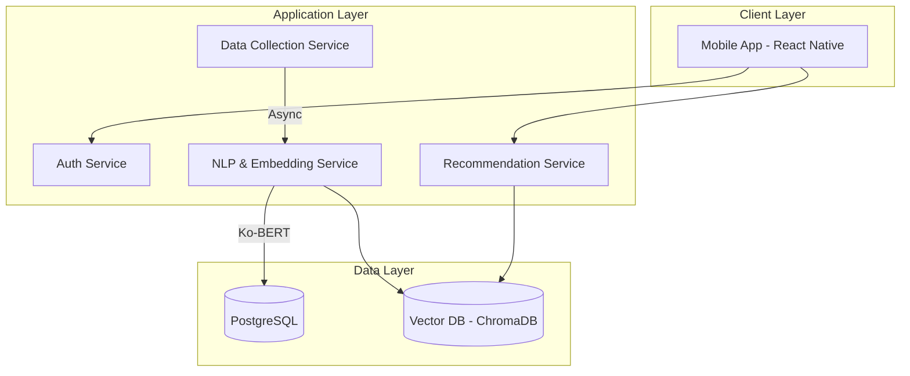

# Portfolio - Cureat: 개인화 미식 탐색 및 추천 플랫폼

사용자의 자연어 취향 입력을 분석하여 실시간 맛집 정보 및 리뷰 데이터를 기반으로 최적의 미식 장소를 추천하는 플랫폼입니다.

## 1. Problem
- **API 응답 지연 (Latency)**: LLM 통신 및 고차원 임베딩 조회 과정이 I/O Bound 작업으로 작용하여 초기 추천 시스템의 응답 속도가 현저히 느려지는 현상 발생.
- **데이터 신뢰도 문제**: 무분별한 광고성 리뷰 콘텐츠가 추천 품질(Data Quality)을 저하시키고 사용자의 시스템 신뢰도를 낮춤.
- **초기 아키텍처 불안정성**: 백엔드와 데이터베이스 간의 연동 설정 및 초기 스키마 설계 오류로 인한 잦은 디버깅 발생.

## 2. Solution
- **비동기 데이터 파이프라인 (Async/Await)**: `asyncio` 라이브러리를 활용하여 LLM API 호출 및 VectorDB I/O 작업을 병렬 처리하도록 재구성하여 동시성(Concurrency) 극대화.
- **Ko-BERT 기반 지능형 필터링**: `Okt` 형태소 분석기로 정제된 텍스트를 **Ko-BERT** 모델로 심층 분석하여 광고성 콘텐츠를 식별하고 고품질의 데이터만 [[RAG]] 시스템에 주입.
- **임베딩 캐싱 전략**: 유사 입력에 대한 중복 연산을 방지하기 위해 VectorDB(ChromaDB)를 임베딩 데이터의 캐시 저장소로 활용.
- **모듈화된 마이크로서비스 구조**: 인증, 지도(Map Service), 데이터 수집, NLP 처리, 추천 엔진을 독립적인 모듈로 설계하여 확장성 확보.
- **위치 기반 서비스 (LBS)**: 사용자 현재 위치 기반 주변 미식 장소 검색 기능을 통합하여 지리적 편의성 제공.

## 3. Performance / Metrics
- **응답 속도 최적화**: 비동기 논블로킹 처리 도입을 통해 전체 시스템 Latency를 유의미하게 개선.
- **데이터 품질 향상**: 광고 필터링 로직 적용을 통해 추천의 정밀도 및 사용자 만족도 지표 확보.
- **아키텍처 안정화**: 초기 스키마 오류 해결 및 단위 테스트([[Unit Test]]) 강화를 통해 시스템 가동률 향상.

## 4. Retrospective
- **Full-Stack 역량 확보**: React Native 프론트엔드부터 FastAPI 백엔드, AI 엔진까지 전체 시스템을 주도적으로 설계 및 구현하며 통합 아키텍트 역량 강화.
- **Agile 협업**: Jira를 활용한 Scrum 방식의 일정 관리 및 Git 기반 협업을 통해 프로젝트 효율성 증대.
- **향후 계획**: CI/CD 파이프라인 조기 구축 및 단위 테스트 자동화를 통해 시스템 안정성을 실제 서비스 수준으로 고도화할 예정.

## Appendix: Technical Stack & Visualization
| 영역 | 스택 | 용도 |
| :--- | :--- | :--- |
| **Backend** | Python (FastAPI) | 고성능 비동기 API 엔드포인트 구축 |
| **AI/NLP** | **Ko-BERT**, Okt, LLM API | 자연어 분석, 임베딩 생성 및 광고 필터링 |
| **Database** | PostgreSQL, ChromaDB | 메타데이터 관리 및 벡터 검색 |
| **Client** | React Native | 크로스 플랫폼 모바일 UI 구현 |

