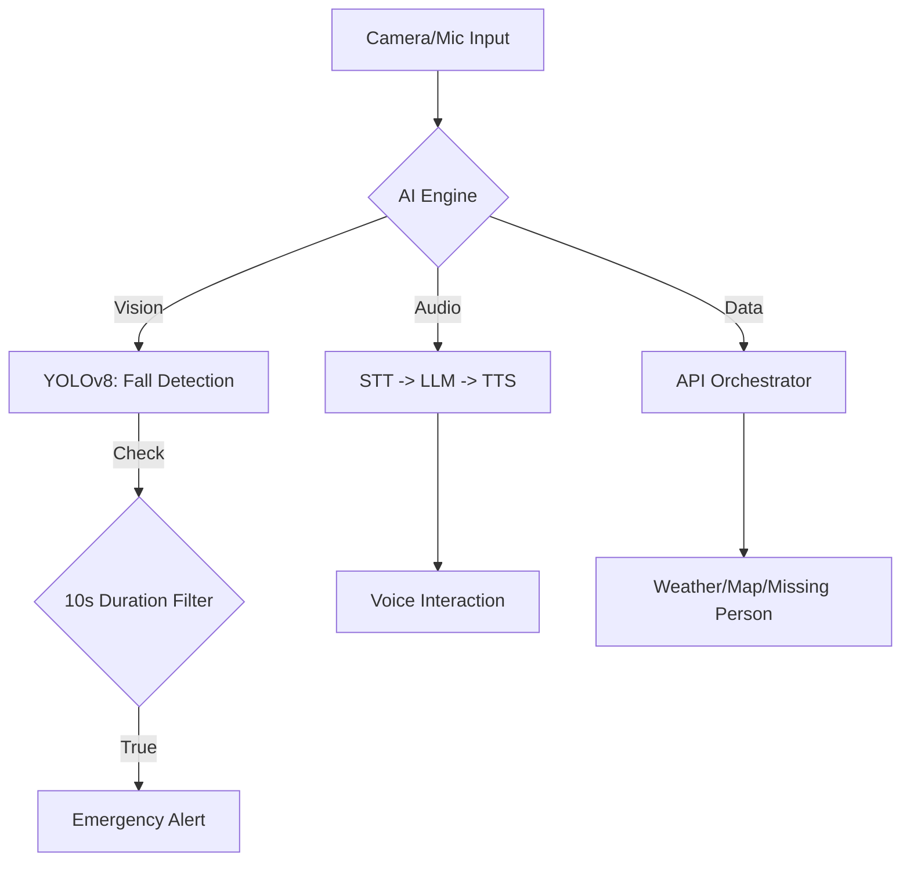

# Portfolio — Dorosee: AI Communicator for Social Safety

> **과학기술정보통신부 2025 UWC 해커톤 최우수상(1위) 수상작** 🏆
> CV/LLM 통합 멀티모달 인터랙션을 통한 디지털 소외계층 지원 및 응급상황 대응 시스템

---

## 1. Problem Definition
- **정보 접근의 불평등**: 고령층 등 디지털 소외계층이 복잡한 UI 대신 자연스러운 음성 인터랙션으로 실시간 정보(날씨, 시설 안내)를 얻을 수 있는 수단 부재.
- **응급 상황 대응 지연**: 거리의 쓰러짐 사고 등 위급 상황을 실시간으로 감지하고 관제 센터로 즉각 전파하는 자동화된 체계 부족.
- **AI 오인식 리스크**: 일시적인 움직임이나 오탐지로 인한 허위 신고(False Alarm) 가능성.

## 2. Technical Implementation
- **고신뢰성 객체 탐지 및 '10초 지속 필터'**: 
    - YOLOv8을 활용하여 '쓰러짐' 상태를 정의하고, 약 30,000개의 데이터셋으로 파인튜닝하여 높은 탐지 정확도 확보.
    - 단순 프레임 단위 탐지의 한계를 극복하기 위해, 특정 상태가 **10초 이상 지속될 때만** 실제 응급 상황으로 간주하는 **Duration Filter** 알고리즘을 설계하여 오탐지율을 획기적으로 개선.
- **Multimodal 인터페이스 파이프라인**: 
    - **VUI(Voice UI)**: Web Speech API(STT)와 OpenAI TTS(nova)를 결합하여 지연 시간을 최소화한 양방향 음성 대화 구현.
    - **Intent-based Routing**: 사용자 입력을 분석하여 기상청(날씨), 카카오맵(위치), 안전Dream(실종자) API로 지능형 라우팅.
- **Unity 3D 기반 HAL(Hardware-in-the-Loop) 시뮬레이션**: 실제 UGV 하드웨어 도입 전, Unity 환경에서 시스템 통합 테스트 및 시나리오 검증을 수행하여 개발 속도 및 안정성 확보.

## 3. Metrics
- **모델 성능**: Recall **92%**, Precision **85%** 달성 (쓰러짐 탐지 기준).
- **오탐지율 개선**: 10초 지속 필터 적용 후 일시적 노이즈에 의한 오신고 발생률 대폭 감소.
- **응답 속도**: OpenAI TTS nova 모델 채택으로 실시간 대화에 적합한 초저지연 음성 합성 구현.

## 4. Business Value
- **공공 안전의 기술적 기여**: 기술을 통한 사회적 난제(실종자 제보, 응급 상황 감지) 해결 모델 제시 및 공공 데이터 API의 효과적인 오케스트레이션 사례 확립.
- **멀티모달 서비스 확장성**: 음성, 영상, 위치 정보를 통합 제어하는 아키텍처를 구축하여 향후 다양한 도메인의 AI 에이전트로 확장 가능한 기술 기반 마련.
- **사회적 가치 및 성과**: 기술적 완성도와 비즈니스/사회적 가치를 동시에 인정받아 과학기술정보통신부 주관 해커톤에서 최우수상 수상.

---

## System Workflow

