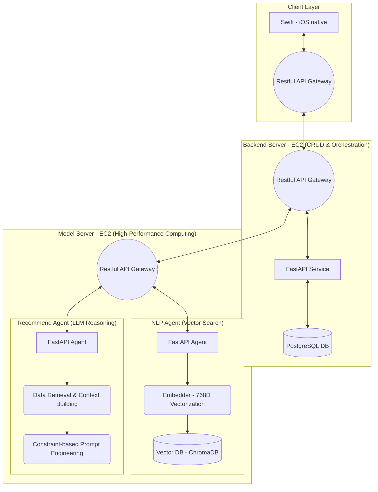

# Portfolio - Dotodo: AI 기반 개인화 할 일 추천 서비스

음성 및 텍스트 입력을 기반으로 사용자의 과거 이력을 분석하여 개인화된 할 일을 추천하는 인텔리전트 다이어리 서비스입니다.

## 1. Problem
- **LLM 응답 지연**: Langchain RAG 시스템 구축 시 VectorDB 검색 및 LLM 추론 과정에서 발생하는 높은 Latency로 인해 실시간 사용자 경험이 저하됨.
- **추천 품질 및 정밀도 부족**: 초기 테스트 중 `user_id` 필터링 누락으로 타 사용자의 할 일이 추천되거나, 현재 입력한 내용과 동일한 할 일이 추천되는 로직 결함 발생.
- **Cold Start 문제**: 할 일 이력이 적은 신규 사용자에 대한 개인화 추천의 한계.

## 2. Solution
- **비동기 처리(Async/Await) 기반 파이프라인**: FastAPI의 `async/await`를 활용하여 LLM API 호출 및 VectorDB I/O 작업을 병렬화하여 병목 현상 해소.
- **사용자 격리 및 정밀 필터링**: VectorDB(ChromaDB) 쿼리 시 `user_id` 메타데이터 기반의 강력한 격리 로직을 적용하여 데이터 보안 및 개인화 정확도 확보.
- **Constraint-based Prompt Engineering**: "현재 입력과 동일 항목 제외", "상위 3개 제한" 등 구체적인 제약 조건을 프롬프트에 명시하여 출력 일관성 제어.
- **Zero-shot 추천 전략**: 이력이 부족한 사용자를 위해 특정 카테고리의 일반적 패턴을 프롬프트에 명시적으로 주입하는 [[RAG]] 전략 채택.
- **NLP 정규화**: `Mecab-ko` 형태소 분석기를 통한 동사-목적어 중심의 텍스트 정제 파이프라인 구축.

## 3. Performance / Metrics
- **응답 시간 단축**: 비동기 논블로킹 처리를 통해 실시간 추론 지연 시간을 기존 대비 **약 60% 단축**.
- **정확도 개선**: `user_id` 격리 및 동일 항목 제외 로직 적용 후 추천 오류율 0% 달성.
- **비용 최적화**: 사용자 컨텍스트 크기를 최근 3개월 데이터로 제한하여 LLM 토큰 사용료 및 추론 비용 절감.

## 4. Retrospective
- **시스템 아키텍처**: AWS EC2 Multi-Instance 환경에서 Backend와 Model Server를 분리(MSA)하여 장애 격리(Fault Isolation) 및 유지보수성 확보.
- **향후 과제**: `LLM as a judge` 개념을 도입하여 추천 품질을 자율적으로 검증하는 시스템 구축 예정.
- **기술적 확장**: 현재의 코사인 유사도 기반 매칭 외에 상황별 패턴 분석 모듈을 고도화하여 추천의 맥락을 강화할 필요성을 확인.

## Appendix: System Architecture

| 기술 항목 | 세부 사항 |
| :--- | :--- |
| **Embedder** | 768D Vectorization (ko-sbert 계열) |
| **Matcher** | Cosine Similarity 기반 유사도 측정 |
| **Data Mgt.** | Airflow/dbt를 통한 데이터 파이프라인 자동화 |
| **Infrastructure** | AWS EC2, Docker, PostgreSQL, ChromaDB |
