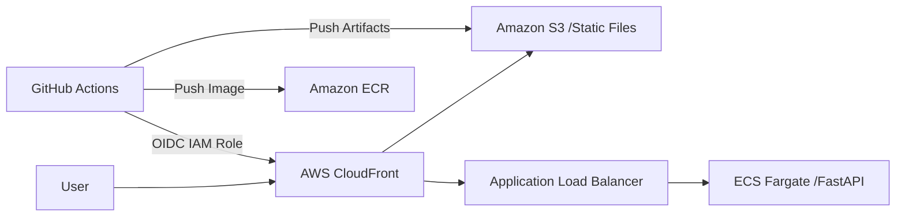

# Portfolio — Hosugator: Cloud-Native Knowledge Graph Portfolio

> **한 줄 요약:** Next.js와 AWS를 활용하여 파편화된 기술 노드를 지식 그래프로 시각화한 서버리스 포트폴리오 사이트

---

## 1. Problem Definition
- **지식 파편화 (Data Fragmentation)**: 2년간 축적된 100여 개의 기술 노드와 15개 이상의 프로젝트 로그가 개별 문서로 존재하여 기술 간 연관성과 학습 궤적 파악이 어려움.
- **정적 포트폴리오의 한계**: 기존의 정적 문서는 복잡한 프로젝트 관계와 동적인 변화를 표현하는 데 한계가 있으며, 사용자 인터랙션이 부재함.
- **글로벌 접근성 부족**: 글로벌 시장 대응을 위한 다국어 지원 및 저지연 콘텐츠 전송 인프라 필요.

## 2. Technical Implementation
- **OIDC 기반 IAM 인증 (GitHub Actions to AWS)**: GitHub Actions와 AWS 간의 신뢰 관계를 **OIDC(OpenID Connect)**를 통해 설정하여, 정적 액세스 키(Access Key) 없이 안전하게 클라우드 리소스를 프로비저닝하고 배포하는 CI/CD 파이프라인 구축.
- **Markdown-to-Graph 정적 파이프라인**: 비정형 Markdown 노트를 파싱하여 태그 및 파일 경로 기반의 노드-링크 구조로 변환. `react-force-graph`를 활용하여 2D/3D 지식 관계망 시각화.
- **서버리스 아키텍처 (SSG + Fargate)**:
    - **Frontend**: Next.js 15의 정적 내보내기(SSG)를 활용하여 S3 및 CloudFront 에지 로케이션에 배포.
    - **Backend**: FastAPI 기반의 API 서버를 ECS Fargate 컨테이너로 운영하여 확장성과 가용성 확보.
- **Lightweight i18n 시스템**: 외부 라이브러리 없이 Context API를 활용한 다국어 상태 관리로 번들 크기 최적화.

## 3. Metrics
- **데이터 시각화**: 100개 이상의 기술 노드와 프로젝트 간의 관계를 실시간 인터랙티브 그래프로 구현.
- **인프라 비용 및 성능**: S3/CloudFront 기반 정적 호스팅으로 유지 비용을 0에 가깝게 유지하면서 글로벌 엣지 가속을 통해 페이지 로딩 속도 최적화.
- **보안성**: OIDC 도입으로 IAM 키 노출 위험 제거 및 전 구간 HTTPS(ACM) 적용.

## 4. Business Value
- **기술적 가독성 및 브랜딩**: 복잡한 엔지니어링 경험을 시각적 지식 그래프로 변환하여 본인의 기술적 깊이와 학습 궤적을 직관적으로 전달.
- **Full-Cycle 엔지니어링 역량 입증**: 요구사항 분석부터 프런트엔드/백엔드 개발, 클라우드 아키텍처 설계, 보안 인증, 자동화 배포까지의 전 과정을 독립적으로 수행하는 능력 증명.
- **효율적인 지식 관리 시스템**: 단순 포트폴리오를 넘어, 개인의 학습 자산을 정형화된 데이터 모델로 관리하는 지속 가능한 지식 관리 체계(Zettelkasten) 구축.

---

## Architecture Diagram

