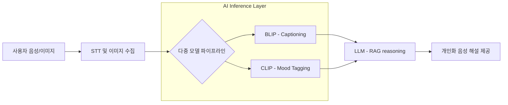

# Portfolio - 소담일기: 시각 장애인을 위한 음성 기반 사진 해설 다이어리

시각 장애인이 사진의 시각 정보를 이해하고 관리할 수 있도록 다중 AI 모델([[VLM]])과 [[RAG]] 시스템을 결합하여 개인화된 음성 해설을 제공하는 서비스입니다.

## 1. Problem
- **고비용 구조**: GPT-4V와 같은 대규모 멀티모달 모델(LMM) 단독 사용 시 발생하는 높은 API 호출 비용 문제.
- **추론 지연**: 다중 AI 모델을 순차적으로 거치는 과정에서 발생하는 긴 응답 대기 시간으로 인한 UX 저하.
- **정보의 부조화**: 이미지의 객관적 정보(캡션)와 주관적 분위기(태깅)를 통합하여 사용자에게 자연스러운 문장으로 전달하는 기술적 난이도.

## 2. Solution
- **다중 모델 파이프라인(BLIP/CLIP Optimization)**: 
    - **BLIP**: 이미지의 객관적 캡션 생성.
    - **CLIP**: 이미지의 분위기 및 감성(약 30여 개 사전 정의 태그) 추출.
    - **LLM**: 추출된 캡션과 태그를 [[RAG]] 기반으로 통합하여 개인화된 자연어 해설 생성.
- **추론 최적화 (OpenVINO & Quantization)**:
    - **4-bit Quantization**: 모델 경량화를 통해 메모리 점유율 및 로딩 시간 단축.
    - **OpenVINO**: Intel 하드웨어 환경에서의 추론 최적화 PoC 진행.
- **비동기 처리(Async/Await)**: `ThreadPoolExecutor` 및 FastAPI 비동기 기능을 활용하여 모델 추론 과정을 병렬화.
- **STT/TTS 통합**: 사용자의 음성 입력을 분석하여 키워드를 추출하고, 최종 해설을 음성으로 제공하는 직관적인 NUI(Natural User Interface) 구현.

## 3. Performance / Metrics
- **운영 비용 절감**: 오픈소스 모델 중심의 파이프라인 구축을 통해 GPT-4V 단독 사용 대비 **운영 비용 약 30% 절감**.
- **응답 속도 향상**: 비동기 병렬 처리 및 경량화 기법 적용으로 전체 응답 시간을 **기존 대비 약 20~50% 단축**.
- **사용자 만족도**: 2025 한국장애인해커톤 본선 진출 및 실증 인터뷰를 통한 서비스 효용성 검증.

## 4. Retrospective
- **사회적 가치 실현**: 디지털 소외 계층을 위한 AI 기술 적용을 통해 기술의 인도적 활용 가능성 확인.
- **기술적 성과**: 모놀리식 구조를 FastAPI 비동기 라우터로 포팅하고 Docker 기반의 안정적인 배포 환경 구축.
- **향후 과제**: 개인화 추천 시스템 고도화(사용자 입력 정보와 유사 객체 매칭) 및 **[[OpenVINO]]** 통합 완성으로 하이브리드 추론 성능 극대화 예정.

## Appendix: Architecture & Flow

| 기술 항목 | 세부 사항 |
| :--- | :--- |
| **Multimodal** | BLIP, CLIP, LLM (Open Source Mix) |
| **Optimization** | **4-bit Quantization**, **OpenVINO** |
| **Infrastructure** | AWS EC2 (Docker), FastAPI, Django |
| **Frontend** | Kotlin (Android) |
