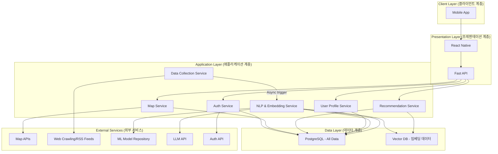

> **Last revised:** `= dateformat(this.file.mtime, "yyyy-MM-dd HH:mm")`

```mermaid
graph TD
    subgraph "Client Layer (클라이언트 계층)"
        A1[Mobile App]
    end

    subgraph "Presentation Layer (프레젠테이션 계층)"
        B1[React Native]
        B2[Fast API]
    end

    subgraph "Application Layer (애플리케이션 계층)"
        C1[Auth Service]
        C2[Map Service]
        C3[Data Collection Service]
        C4[NLP & Embedding Service]
        C5[Recommendation Service]
        C6[User Profile Service]
    end

    subgraph "Data Layer (데이터 계층)"
        D1[PostgreSQL - All Data]
        D3[Vector DB - 임베딩 데이터]
    end

    subgraph "External Services (외부 서비스)"
        E1[Map APIs]
        E2[Web Crawling/RSS Feeds]
        E3[ML Model Repository]
        E4[LLM API]
        E5[Auth API]
    end
    
    %% Request-Response Flow (동기적)
    A1 --> B1
    B1 --> B2
    B2 --> C1 & C2 & C5 & C6
    C1 --> D1
    C2 --> D1
    C1 --> E5
    C2 --> E1
    C5 --> D1
    C6 --> D1
    
    %% AI-based Recommendation & Data Processing Flow (비동기적)
    C3 --> E2
    C3 -- Async trigger --> C4
    C4 --> D1
    C4 --> D3
    C4 --> E3 & E4
    
    %% Data retrieval for processing
    C4 --> D1
    
    %% Recommendation service using processed data
    C5 --> D3
```

