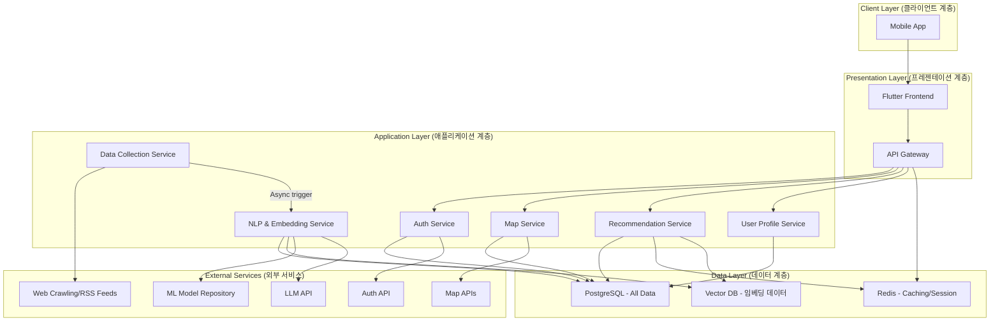
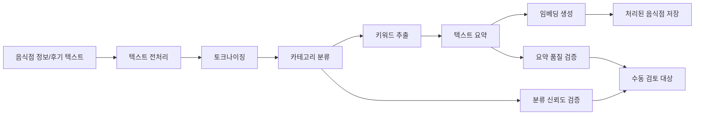
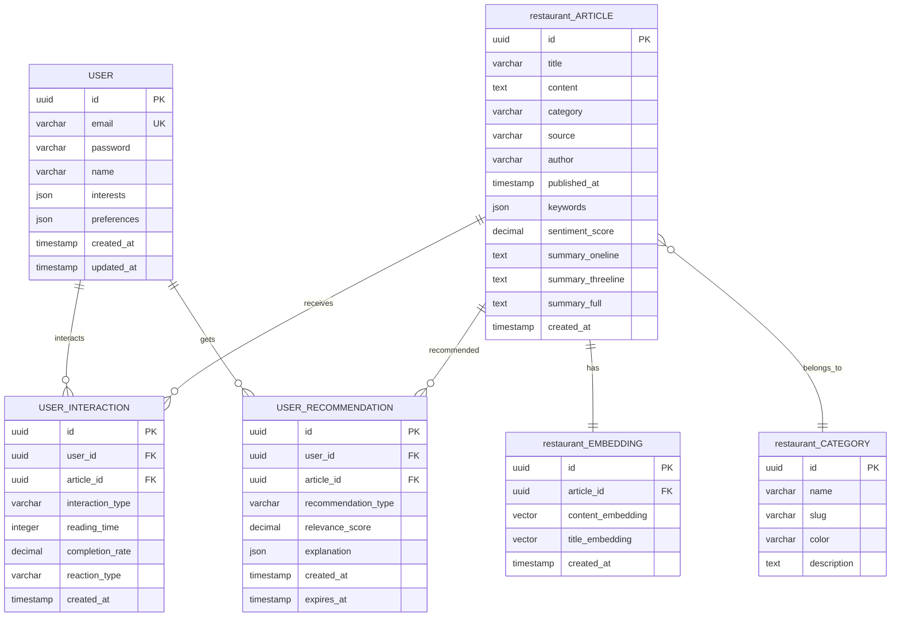

# 3. 어플리케이션&시스템 아키텍처 설계

## 3.1 아키텍처 개요

### 3.1.1 시스템 목적

**핵심 목표**: 원하는 식사 경험을 찾기 위해 다소의 시간을 소모하는 것을 줄이고 개인화되고 소비자가 요구에 맞춘 추천 시스템과 함께 분 미만의 시간을 소모하여 찾을 수 있는 AI 기반 맛집 탐방 시스템

**주요 가치**:

- 즉시 제공 (1분 이내 요구하는 맛집 정보 제공)
- 개인화 추천 (관심사 기반 80% 이상 정확도)
- 검색/추천 응답 시간 10초 이내
- 광고 제거에 대한 사용자 만족도 80% 이상 달성

### 3.1.2 아키텍처 설계 원칙

### 🎯 핵심 원칙

1. **AI 중심 설계**: NLP 모델의 성능을 최대화하는 아키텍처
2. **데이터 품질 우선**: 고품질 맛집 데이터 수집 및 처리
3. **확장성**: 맛집과 리뷰 소스 및 사용자 증가에 유연한 대응

### 🏗️ 아키텍처 패턴

- **패턴**: Microservice
- **통신**: RESTful API + Client-Server
- **데이터**: Event Sourcing + CQRS Pattern
- **AI/ML**: Model Serving + Batch Processing

## 3.2 전체 시스템 아키텍처

### 3.2.1 고수준 아키텍처 (High-Level Architecture)



### 3.2.2 시스템 컴포넌트 정의

| 계층               | 컴포넌트                          | 역할              | 기술 스택                          |
| ---------------- | ----------------------------- | --------------- | ------------------------------ |
| **Client**       | Web Browser                   | 음식점 큐레이션 UI 제공  | Chrome, Safari, Edge           |
| **Client**       | Mobile App                    | 모바일 음식점 소비      | React PWA                      |
| **Presentation** | React Frontend                | 개인화 대시보드 UI/UX  | React 18, TypeScript, Tailwind |
| **Presentation** | API Gateway                   | 요청 라우팅, 인증, 로깅  | Express.js, JWT, Rate Limiting |
| **Application**  | Auth Service                  | 사용자 인증/권한 관리    | Node.js, Passport.js           |
| **Application**  | restaurant Collection Service | 음식점 수집 및 전처리    | Python, Scrapy, Celery         |
| **Application**  | NLP Processing Service        | 텍스트 분류/요약 AI 모델 | Python, FastAPI, Transformers  |
| **Application**  | Recommendation Service        | 개인화 추천 알고리즘     | Python, scikit-learn           |
| **Application**  | User Profile Service          | 사용자 관심사 관리      | Node.js, Express               |
| **Data**         | PostgreSQL                    | 사용자, 음식점 메타데이터  | PostgreSQL 15                  |
| **Data**         | Redis Cache                   | 세션, 추천 결과 캐싱    | Redis 7                        |
| **Data**         | Vector DB                     | 음식점 임베딩 저장      | Faiss                          |

## 3.3 상세 컴포넌트 설계

### 3.3.1 프론트엔드 아키텍처

### 📱 컴포넌트 구조 (React)

```
src/
├── components/          # 재사용 컴포넌트
│   ├── restaurant/           # 음식점 관련 컴포넌트
│   │   ├── restaurantCard.tsx      # 음식점 카드
│   │   ├── restaurantList.tsx      # 음식점 목록
│   │   ├── SummaryLevels.tsx # 요약 레벨 선택
│   │   └── CategoryFilter.tsx # 카테고리 필터
│   ├── common/         # 공통 UI
│   │   ├── Header.tsx
│   │   ├── Sidebar.tsx
│   │   └── LoadingSpinner.tsx
│   └── user/          # 사용자 관련
│       ├── ProfileSettings.tsx
│       └── InterestPicker.tsx
├── pages/              # 페이지 컴포넌트
│   ├── Dashboard.tsx   # 메인 대시보드
│   ├── restaurantDetail.tsx  # 음식점 상세보기
│   ├── Categoryrestaurant.tsx # 카테고리별 음식점
│   └── Settings.tsx    # 개인화 설정
├── hooks/              # 커스텀 훅
│   ├── userestaurant.ts      # 음식점 데이터 훅
│   ├── useRecommendations.ts # 추천 훅
│   └── useUserProfile.ts # 사용자 프로필 훅
├── services/           # API 서비스
│   ├── restaurantApi.ts      # 음식점 API 호출
│   ├── userApi.ts      # 사용자 API
│   └── recommendationApi.ts # 추천 API
├── store/              # 전역 상태 (Zustand)
│   ├── restaurantStore.ts    # 음식점 상태
│   ├── userStore.ts    # 사용자 상태
│   └── appStore.ts     # 앱 전역 상태
└── utils/              # 유틸리티
    ├── textProcessing.ts # 텍스트 처리
    └── analytics.ts    # 사용자 행동 추적

```

### 🔄 상태 관리 설계

```tsx
// 음식점 관련 전역 상태
interface restaurantState {
  // 음식점 데이터
  personalizedrestaurant: restaurantItem[];
  categoryrestaurant: { [category: string]: restaurantItem[] };
  trendingrestaurant: restaurantItem[];

  // UI 상태
  selectedCategory: string | null;
  summaryLevel: 'oneline' | 'threeline' | 'full';
  isLoading: boolean;

  // 필터링 & 검색
  searchQuery: string;
  filters: {
    dateRange: DateRange;
    sources: string[];
    readStatus: 'all' | 'read' | 'unread';
  };
}

// 사용자 관련 상태
interface UserState {
  // 사용자 정보
  profile: UserProfile | null;
  interests: Interest[];
  readingHistory: ReadingHistory[];

  // 개인화 설정
  preferredSummaryLevel: 'oneline' | 'threeline' | 'full';
  preferredCategories: string[];
  notificationSettings: NotificationSettings;
}

```

### 3.3.2 백엔드 마이크로서비스 아키텍처

### 🏗️ 서비스별 구조

### restaurant Collection Service (음식점 수집 서비스)

```python
# 음식점 수집 서비스 구조
restaurant_collection/
├── app/
│   ├── collectors/         # 수집기들
│   │   ├── rss_collector.py      # RSS 피드 수집
│   │   ├── api_collector.py      # 음식점 API 수집
│   │   └── web_scraper.py        # 웹 크롤링
│   ├── processors/         # 전처리기들
│   │   ├── text_cleaner.py       # 텍스트 정제
│   │   ├── duplicate_detector.py # 중복 제거
│   │   └── quality_filter.py     # 품질 필터링
│   ├── models/            # 데이터 모델
│   │   ├── restaurant_item.py
│   │   └── source_config.py
│   ├── services/          # 비즈니스 로직
│   │   ├── collection_service.py
│   │   └── scheduling_service.py
│   └── api/              # API 엔드포인트
│       └── collection_api.py
├── config/               # 설정 파일
│   ├── restaurant_sources.yaml       # 음식점 소스 설정
│   └── collection_schedule.yaml # 수집 스케줄
└── tests/

```

### NLP Processing Service (자연어 처리 서비스)

```python
# NLP 서비스 구조
nlp_service/
├── app/
│   ├── models/            # AI 모델들
│   │   ├── text_classifier.py   # 음식점 분류 모델
│   │   ├── text_summarizer.py   # 텍스트 요약 모델
│   │   ├── embedding_model.py   # 텍스트 임베딩
│   │   └── model_manager.py     # 모델 관리
│   ├── services/          # NLP 비즈니스 로직
│   │   ├── classification_service.py
│   │   ├── summarization_service.py
│   │   └── similarity_service.py
│   ├── preprocessing/     # 전처리
│   │   ├── korean_tokenizer.py  # 한국어 토크나이징
│   │   ├── text_normalizer.py   # 텍스트 정규화
│   │   └── feature_extractor.py # 특성 추출
│   └── api/              # FastAPI 엔드포인트
│       ├── classification_api.py
│       ├── summarization_api.py
│       └── health_check.py
├── models/               # 저장된 모델 파일
│   ├── classifier/
│   ├── summarizer/
│   └── embeddings/
└── training/            # 모델 학습 스크립트
    ├── train_classifier.py
    └── train_summarizer.py

```

### 🤖 NLP 처리 파이프라인



### 3.3.3 추천 시스템 아키텍처

### Recommendation Service

```python
# 추천 시스템 구조
recommendation_service/
├── app/
│   ├── algorithms/        # 추천 알고리즘들
│   │   ├── collaborative_filtering.py  # 협업 필터링
│   │   ├── content_based.py           # 콘텐츠 기반
│   │   ├── hybrid_recommender.py      # 하이브리드
│   │   └── popularity_based.py        # 인기도 기반
│   ├── models/           # 데이터 모델
│   │   ├── user_profile.py
│   │   ├── restaurant_interaction.py
│   │   └── recommendation.py
│   ├── services/         # 비즈니스 로직
│   │   ├── recommendation_service.py
│   │   ├── user_modeling_service.py
│   │   └── evaluation_service.py
│   ├── utils/           # 유틸리티
│   │   ├── similarity_calculator.py
│   │   ├── diversity_optimizer.py
│   │   └── cold_start_handler.py
│   └── api/             # API 엔드포인트
│       ├── recommendation_api.py
│       └── feedback_api.py
├── data/                # 훈련 데이터
└── experiments/         # 실험 및 평가
    ├── ab_testing.py
    └── metrics_evaluation.py

```

## 3.4 데이터 아키텍처

### 3.4.1 데이터베이스 설계

### 🗄️ ERD (Entity Relationship Diagram)



### 📋 핵심 테이블 스키마

- **사용자 테이블**
    
    ```sql
    CREATE TABLE users (
        id UUID PRIMARY KEY DEFAULT gen_random_uuid(),
        email VARCHAR(255) UNIQUE NOT NULL,
        password VARCHAR(255) NOT NULL,
        name VARCHAR(100) NOT NULL,
        interests JSONB DEFAULT '[]'::jsonb,  -- 관심 카테고리 및 키워드
        preferences JSONB DEFAULT '{}'::jsonb, -- 요약 레벨, 알림 설정 등
        created_at TIMESTAMP DEFAULT CURRENT_TIMESTAMP,
        updated_at TIMESTAMP DEFAULT CURRENT_TIMESTAMP
    );
    
    -- 인덱스
    CREATE INDEX idx_users_email ON users(email);
    CREATE INDEX idx_users_interests ON users USING GIN(interests);
    
    ```
    
- **음식점 기사 테이블**
    
    ```sql
    CREATE TABLE restaurant_articles (
        id UUID PRIMARY KEY DEFAULT gen_random_uuid(),
        title VARCHAR(500) NOT NULL,
        content TEXT NOT NULL,
        category VARCHAR(50) NOT NULL,
        source VARCHAR(100) NOT NULL,
        author VARCHAR(100),
        published_at TIMESTAMP NOT NULL,
        keywords JSONB DEFAULT '[]'::jsonb,
        sentiment_score DECIMAL(3,2),
        summary_oneline TEXT,        -- AI 생성 1줄 요약
        summary_threeline TEXT,      -- AI 생성 3줄 요약
        summary_full TEXT,           -- AI 생성 전체 요약
        url VARCHAR(1000),
        image_url VARCHAR(1000),
        created_at TIMESTAMP DEFAULT CURRENT_TIMESTAMP
    );
    
    -- 인덱스
    CREATE INDEX idx_restaurant_category ON restaurant_articles(category);
    CREATE INDEX idx_restaurant_published_at ON restaurant_articles(published_at);
    CREATE INDEX idx_restaurant_keywords ON restaurant_articles USING GIN(keywords);
    CREATE INDEX idx_restaurant_source ON restaurant_articles(source);
    
    ```
    
- **사용자 상호작용 테이블**
    
    ```sql
    CREATE TABLE user_interactions (
        id UUID PRIMARY KEY DEFAULT gen_random_uuid(),
        user_id UUID REFERENCES users(id) ON DELETE CASCADE,
        article_id UUID REFERENCES restaurant_articles(id) ON DELETE CASCADE,
        interaction_type VARCHAR(20) NOT NULL, -- 'view', 'click', 'like', 'share'
        reading_time INTEGER,                  -- 초 단위
        completion_rate DECIMAL(3,2),         -- 읽기 완료율 (0.0-1.0)
        reaction_type VARCHAR(20),             -- 'positive', 'negative', 'neutral'
        summary_level VARCHAR(20),             -- 'oneline', 'threeline', 'full'
        created_at TIMESTAMP DEFAULT CURRENT_TIMESTAMP
    );
    
    -- 인덱스
    CREATE INDEX idx_interactions_user_id ON user_interactions(user_id);
    CREATE INDEX idx_interactions_article_id ON user_interactions(article_id);
    CREATE INDEX idx_interactions_created_at ON user_interactions(created_at);
    
    ```
    
- **추천 결과 테이블**
    
    ```sql
    CREATE TABLE user_recommendations (
        id UUID PRIMARY KEY DEFAULT gen_random_uuid(),
        user_id UUID REFERENCES users(id) ON DELETE CASCADE,
        article_id UUID REFERENCES restaurant_articles(id) ON DELETE CASCADE,
        recommendation_type VARCHAR(30), -- 'personalized', 'trending', 'similar'
        relevance_score DECIMAL(5,4),   -- 0.0000-1.0000
        explanation JSONB,              -- 추천 이유 설명
        created_at TIMESTAMP DEFAULT CURRENT_TIMESTAMP,
        expires_at TIMESTAMP,           -- 추천 유효기간
    
        UNIQUE(user_id, article_id, recommendation_type)
    );
    
    -- 인덱스
    CREATE INDEX idx_recommendations_user_id ON user_recommendations(user_id);
    CREATE INDEX idx_recommendations_score ON user_recommendations(relevance_score DESC);
    CREATE INDEX idx_recommendations_expires_at ON user_recommendations(expires_at);
    
    ```
    

### 3.4.2 벡터 데이터베이스 설계 (임베딩 저장)

- **음식점 임베딩 저장소**
    
    ```python
    # Vector DB 스키마 (Pinecone/Chroma 사용)
    embedding_schema = {
        "id": "article_uuid",
        "vector": [768_dimensional_embedding],  # BERT 임베딩
        "metadata": {
            "title": "음식점 제목",
            "category": "카테고리",
            "published_at": "발행일시",
            "source": "음식점 소스",
            "keywords": ["키워드1", "키워드2"],
            "summary_oneline": "1줄 요약"
        }
    }
    
    # 유사 음식점 검색 쿼리
    def find_similar_restaurant(article_embedding, top_k=5):
        results = vector_db.query(
            vector=article_embedding,
            top_k=top_k,
            include_metadata=True,
            filter={"category": {"$ne": "advertisement"}}
        )
        return results
    
    ```