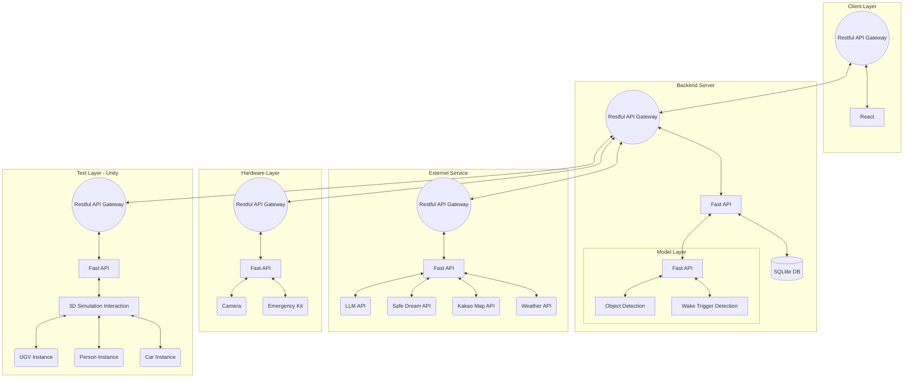

#project #dorosee #시스템아키텍처 

```mermaid
graph TD
    %% 노드 모양 규칙 적용
    %% 출입 경계: (())
    %% 큰 단위 로직: []
    %% 작은 단위 로직: ()
    %% 저장소: [()]
    
    subgraph "Client Layer"
        A00((Restful API Gateway))
        A10[React]
    end

    subgraph "Backend Server"
        B00((Restful API Gateway))
        B10[Fast API]
        B90[(SQLlite DB)]
        
        subgraph "Model Layer"
            C00[Fast API]
            C10[Object Detection]
            C20[Wake Trigger Detection]
        end
    end
    
    subgraph "Externel Service"
        D00((Restful API Gateway))
        D10[Fast API]
        D20(LLM API)
        D30(Safe Dream API)
        D40(Kakao Map API)
        D50(Weather API)
    end
    
	subgraph "Hardware Layer"
		E00((Restful API Gateway))
		E10[Fast API]
		E20(Camera)
		E30(Emergency Kit)
    end
    
    subgraph "Test Layer - Unity"
	    F00((Restful API Gateway))
        F10[Fast API]
        F20[3D Simulation Interaction]
        F30(UGV Instance)
        F40(Person Instance)
        F50(Car Instance)
    end
    
    %% Flow
    A00 <--> B00
    B00 <--> E00
    B00 <--> D00
    
    A00 <--> A10
    
    B00 <--> B10
    B00 <--> F00
    B10 <--> C00
    B10 <--> B90
    
    C00 <--> C10
    C00 <--> C20
    
    D00 <--> D10
    D10 <--> D20
    D10 <--> D30
    D10 <--> D40
    D10 <--> D50
    
    E00 <--> E10
    E10 <--> E20
    E10 <--> E30
    
    %% Test Flow (F20이 모든 인스턴스와 통신하도록 수정)
    F00 <--> F10
    F10 <--> F20
    F20 <--> F30
    F20 <--> F40
    F20 <--> F50
```
