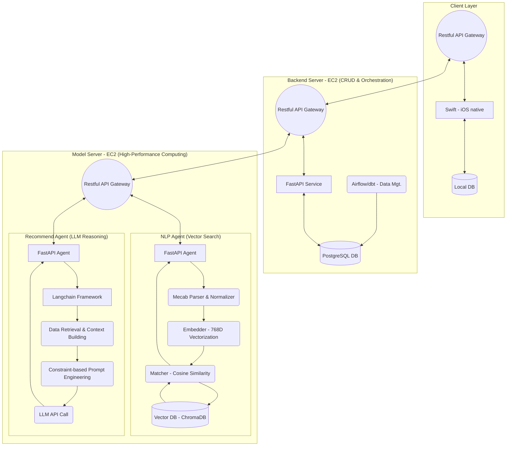

# Portfolio - Dotodo - AI 기반 할 일 추천 서비스 개발
## 시스템 아키텍처
프로젝트의 핵심 비즈니스 로직(CRUD)과 고성능 연산 로직(NLP/ML)을 분리하기 위해 AWS EC2 기반의 Multi-Instance MSA(Microservices Architecture) 구조를 설계 및 구현했습니다.
### 구조 분리
Backend Server (FastAPI, PostgreSQL)와 Model Server (FastAPI, Langchain, VectorDB)로 서버를 다중화하여 트래픽 부하 및 장애를 격리(Fault Isolation)했습니다.
### 기술적 이점
각 서버는 독립적인 배포 및 확장(Scaling)이 가능하여, LLM 모델 교체나 NLP 로직 변경 시에도 메인 백엔드 서비스의 안정성 및 유지보수성을 확보했습니다.
### 통신 일관성
모든 서비스 통신은 FastAPI 기반의 Restful API Gateway를 통해 표준화된 JSON/HTTP 프로토콜을 사용하도록 강제하여, 클라이언트-서버 간의 통신 일관성을 극대화했습니다.
### 구조

| 용어                                  | 설명                                                                                                                                                  | 전문성 보완 (문제 해결/가치)                                                                                                                                                                                                                                 |
| ----------------------------------- | --------------------------------------------------------------------------------------------------------------------------------------------------- | ------------------------------------------------------------------------------------------------------------------------------------------------------------------------------------------------------------------------------------------------- |
| Airflow/dbt - Data Mgt.             | Airflow (Apache Airflow): 데이터 파이프라인의 스케줄링 및 모니터링을 담당하는 워크플로우 관리 플랫폼입니다. dbt (data build tool): 데이터 변환(Transformation) 로직을 SQL 기반으로 정의하고 실행하는 도구입니다. | 데이터 과학 프로젝트에서 데이터 신뢰성(Data Reliability) 및 일관성을 확보하는 데 필수적입니다. Airflow를 통해 사용자 활동 데이터의 정기적인 동기화(data_sync_dag) 및 추천 지표 업데이트(metrics_update_dag)를 자동화하여, 모델 서버가 항상 최신 상태의 학습 및 추론 데이터를 사용하도록 데이터 신선도(Freshness)를 유지합니다.                             |
| Embedder - 768D Vectorization       | 임베딩(Embedding) 모델을 사용하여 텍스트(예: "헬스장 가기")를 768차원의 실수 벡터로 변환하는 과정입니다. 벡터의 각 차원은 단어의 의미적 특징을 나타냅니다.                                                    | 성능 최적화 관점입니다. 768차원은 일반적으로 BERT 또는 Sentence-Transformer 계열의 고품질 임베딩 모델(예: ko-sbert)을 사용했음을 시사합니다. 높은 차원의 임베딩은 의미적 정확도를 높이지만, 검색 속도와 저장 공간에 영향을 줍니다. 768D 벡터를 사용함으로써 유사도 검색의 정확도를 극대화하고, 이를 Vector DB에 저장하여 수백만 건의 데이터에서도 밀리초 단위의 고속 검색을 가능하게 합니다. |
| Matcher - Cosine Similarity         | 두 벡터 간의 코사인 유사도(Cosine Similarity)를 측정하여 두 텍스트가 의미적으로 얼마나 유사한지 수치화하는 로직입니다. (벡터 간의 각도를 측정)                                                          | 추천의 정확성을 확보하는 핵심 알고리즘입니다. 유클리드 거리와 달리, 벡터의 크기(빈도)가 아닌 방향(의미)만을 비교하여, "헬스"와 "운동"처럼 표현 방식은 다르지만 의미는 유사한 할 일을 정확하게 매칭하고 추천의 정확도를 높입니다.                                                                                                               |
| Data Retrieval & Context Building   | RAG(검색 증강 생성) 시스템의 첫 단계입니다. LLM에 질문(새 할 일)이 들어오면, Vector DB 등에서 관련 있는 사용자 과거 이력을 검색(Retrieval)하고, 이를 프롬프트의 배경 정보(Context)로 구성하는 과정입니다.              | 개인화 및 비용 효율성을 달성합니다. 단순히 LLM에 모든 질문을 던지는 것이 아니라, 검색된 소수의 관련 데이터만을 LLM에 제공하여 LLM의 환각(Hallucination)을 방지하고, 개인화된 답변을 유도합니다. 또한, LLM 입력 토큰 수를 최소화하여 API 사용 비용을 절감하는 효과도 얻습니다.                                                                        |
| Constraint-based Prompt Engineering | LLM에게 답변을 요청할 때, 단순히 질문만 던지는 것이 아니라 특정 형식, 규칙, 제약 조건(Constraints)을 명확하게 부여하여 답변을 유도하는 프롬프트 설계 기법입니다.                                                | 출력 일관성 및 안정성을 확보하는 핵심 기술입니다. "추천 항목은 반드시 3가지여야 하며, 카테고리를 벗어나서는 안 된다"와 같은 제약 조건을 프롬프트에 명시하여, LLM이 예측 불가능한 답변을 내놓는 것을 통제하고, 백엔드 시스템이 처리하기 쉬운 구조화된(JSON 등) 출력을 유도하여 서비스의 안정성을 높입니다.                                                                  |

## 핵심 기능
### Langchain 기반 LLM RAG 시스템 구현 및 최적화
사용자의 과거 할 일 이력(To-do History)을 활용하여 RAG(Retrieval-Augmented Generation) 시스템을 구축하고, 개인화된 할 일 추천 기능을 제공했습니다.
- 개인화된 Context 생성: 사용자의 최근 3개월간의 할 일 데이터를 검색(Retrieval)하여 LLM 프롬프트에 동적으로 삽입했습니다.
- 제로샷(Zero-shot) 추천 전략: 이력이 적은 신규 사용자(Cold Start Problem)를 위해, LLM 프롬프트 엔지니어링 단계에서 특정 카테고리(운동, 공부 등)에 대한 일반적인 패턴을 명시적으로 주입하여 초기에도 유의미한 추천 결과를 도출하도록 시스템을 설계했습니다.
- 일관성 제어: Langchain의 매개변수(Temperature, Top-P 등) 튜닝을 통해 LLM의 창의성(Creativity)을 제어하고, 추천 결과가 사용자 이력과 문맥상 연관성을 가지도록 일관성 있는 추천 결과를 보장했습니다.
### 고성능 추천을 위한 VectorDB 및 NLP 파이프라인
응답 속도와 정확도를 동시에 확보하기 위해 LLM 외에 코사인 유사도 기반의 추천 시스템을 병행 구축했습니다.
- 정규화 및 분석: Mecab-ko 형태소 분석기를 사용하여 사용자 입력값을 동사-목적어 형태의 명사 위주로 정제하고, To-do 텍스트를 일관된 형태로 정규화했습니다. (예: "헬스장 가야 해" -> "헬스장")
- 고속 유사도 검색: 정규화된 To-do 텍스트를 고차원 임베딩 벡터로 변환하고, 이를 ChromaDB(Vector DB)에 저장하여 실시간으로 코사인 유사도를 계산했습니다.
- 유사 할 일 추천: 현재 입력된 할 일과 유사도가 높은 과거 항목을 찾아 추천합니다.
- 빈도수 기반 추천: 임베딩 벡터가 아닌, 카테고리별 또는 시간대별 공통 빈도수가 높은 To-do를 토큰화 없이 실시간으로 추출하여 추천 다양성을 확보했습니다.
### 프론트엔드 및 사용자 경험 (iOS Native)
- Swift 기반 네이티브 앱: Swift를 사용하여 iOS 네이티브 앱을 개발하여 최적화된 성능과 일관된 UI/UX를 제공했습니다.
- iOS 네이티브 기능 활용: iOS의 핵심 기능인 바탕화면 및 잠금화면 위젯을 구현하여, 사용자가 앱을 실행하지 않고도 할 일을 확인하고 빠른 상호작용을 할 수 있도록 사용성(Usability)을 극대화했습니다.
## 문제 해결 및 성능 분석 (Troubleshooting & Optimization)
### 사용자 ID 불일치 문제 해결
문제 정의: 모델 서버 통합 테스트 중, `/process-text` 엔드포인트에서 요청에 사용된 `user_id`와 전혀 다른 사용자의 기록이 추천 결과에 반환되는 Critical Bug가 발생했습니다. (`dotodo - 모델 서버 통합 테스트와 추천 알고리즘 개발.md` 참고) 원인 분석: API 호출 과정에서 `user_id`가 Model Server로 올바르게 전달되지 않거나, VectorDB 쿼리 시 `user_id` 필터링 로직이 누락된 것이 원인이었습니다. 해결 방안:
1. API 계층 점검: Backend Server의 Orchestration 로직에서 `user_id`를 모든 Model Server 호출 시 필수 매개변수로 명확하게 전달하도록 수정했습니다.
2. DB 격리 강화: VectorDB 쿼리 시, `where` 절에 현재 요청의 `user_id`에 대한 강력한 필터링 조건을 추가하여, 다른 사용자 데이터가 검색되는 것을 원천 차단했습니다. 이를 통해 데이터 보안 및 개인화 정확도를 보장했습니다.
### 추천 결과의 품질 및 유용성 개선
문제 정의: 초기 추천 로직이 테스트 더미 데이터의 날짜 필터링 미작동 문제로 인해, 입력된 할 일과 동일하거나 의미 없는 항목을 반환하여 추천의 유용성이 저하되었습니다. (`dotodo - 모델 서버 통합 테스트와 추천 알고리즘 개발.md` 참고) 해결 방안:
1. 동일 항목 제외 규칙: `recommender.py` 로직을 수정하여, 현재 사용자가 입력한 `simplified_text`와 정확히 일치하는 과거 항목은 추천 목록에서 제외하는 규칙을 추가하여 추천의 다양성을 확보했습니다.
2. Top-K 제한: 사용자에게 과도한 정보를 제공하는 것을 방지하고 실질적인 선택을 유도하기 위해, 최종 추천 항목을 상위 3개로 제한하는 로직을 적용하여 사용자 경험(UX)을 개선했습니다.
### Langchain 기반 RAG 시스템 응답 속도 최적화
Langchain RAG 시스템의 특성상 VectorDB 검색 시간과 LLM 추론 시간으로 인해 응답 지연이 발생했습니다.
- 비동기 처리(Async/Await): FastAPI의 비동기 기능을 활용하여 LLM API 호출 및 VectorDB I/O 작업을 병렬 처리하여 전체 응답 시간을 단축했습니다.
- Context 크기 조정: 프롬프트에 삽입되는 사용자 이력(Context)의 크기를 최소화(예: 3개월치 데이터만 사용)하여 LLM 추론 비용과 응답 시간의 균형을 맞췄습니다.
![[performance_comparison_korean_20250925_175004.png]]
## 회고 및 향후 개선 방안
AWS, Docker, MSA 분리, NLP Agent 등 현업에서 요구되는 핵심 기술 스택을 성공적으로 통합하고 구현하여, 복잡한 시스템 구축 역량을 효과적으로 입증할 수 있었습니다. 시간 및 협업의 한계로 인해 당장의 결과물에는 반영하지 못했지만, Agent의 고도화된 기능 개발에 대한 필요성을 확인했습니다. 향후 개선점으로 아래의 목표점을 잡고 추진 중에 있습니다.
- LLM 평가 시스템: `LLM as a judge` 개념을 도입하여, 추천 결과를 생성하는 LLM과 그 결과를 평가하는 별도의 LLM을 두어 추천 품질을 자율적으로 검증하고 개선하는 메커니즘을 구축할 수 있습니다.
- 다중 추천 로직 고도화: 현재의 코사인 유사도/빈도수 추천 외에, "패턴/문맥/연관성" 기반의 다중 추천 모듈을 세분화하여 (예: 운동 시 패턴 추천, 요리 시 연관성 추천), 상황별 추천 정확도를 비약적으로 향상시킬 수 있습니다.