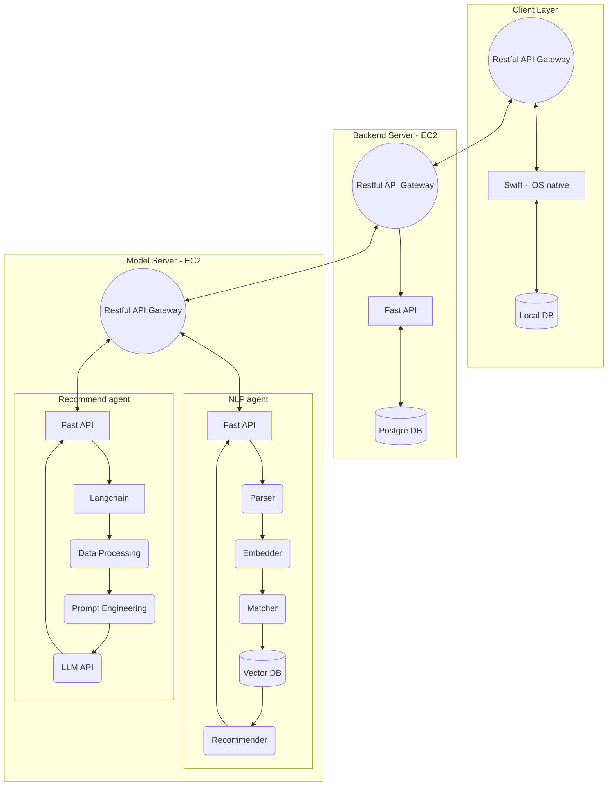

#dotodo #시스템아키텍처 #project

```mermaid
graph TD
    %% 노드 모양 규칙 적용
    %% 경계/진입점/출구: (()) (이중 원형)
    %% 큰 단위/처리 로직: [] (사각형) 또는 () (둥근 사각형)
    %% 저장소: [()] (실린더)
    
    subgraph "Client Layer"
        A00((Restful API Gateway))
        A10[Swift - iOS native]
        A90[(Local DB)]
    end

    subgraph "Backend Server - EC2"
        B00((Restful API Gateway))
        B90[(Postgre DB)]
        B10[Fast API]
    end

    subgraph "Model Server - EC2"
        C00((Restful API Gateway))
        subgraph "NLP agent"
            D00[Fast API]
            D10(Parser)
            D20(Embedder)
            D30(Matcher)
            D40(Recommender)
            D90[(Vector DB)]
        end
        subgraph "Recommend agent"
            E00[Fast API]
            E05[Langchain]
            E10(Data Processing)
            E20(Prompt Engineering)
            E30(LLM API)
        end
    end
    
    %% Flow
    A00 <--> A10
    A10 <--> A90
    A00 <--> B00
    
    B00 --> B10
    B00 <--> C00
    B10 <--> B90

    C00 <--> D00
    C00 <--> E00
    
    D00 --> D10
    D10 --> D20
    D20 --> D30
    D30 --> D90
    D90 --> D40
    D40 --> D00
    
    E00 --> E05
    E05 --> E10
    E10 --> E20
    E20 --> E30
    E30 --> E00
    
```

