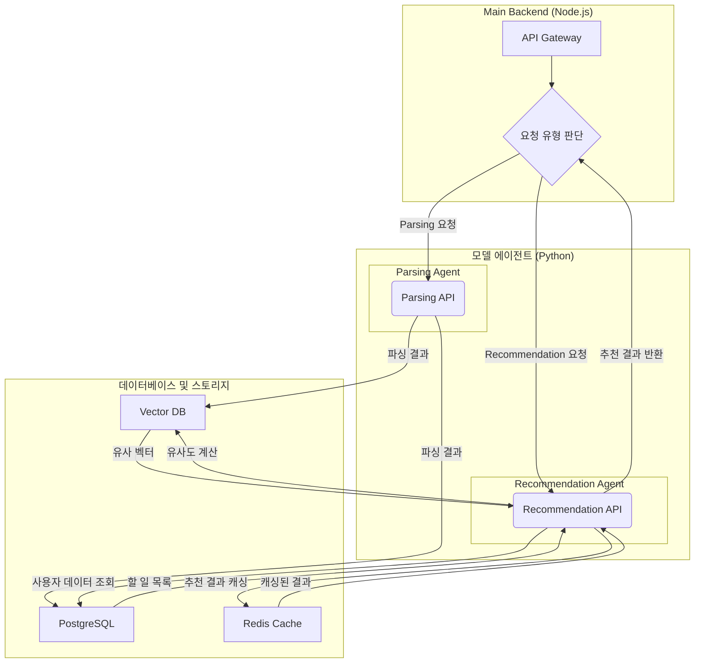

네, 말씀하신 내용을 바탕으로 모델 개발자 측의 아키텍처를 구성해 보았습니다.

### 1. 모델 시스템 아키텍처

---

모델 시스템은 두 가지 주요 에이전트로 구성됩니다.

- **파싱 에이전트:** 사용자의 자연어 입력을 받아 할 일, 날짜, 시간 등으로 분리하고 유사도 분석에 필요한 임베딩 벡터를 생성합니다.
    
- **추천 에이전트:** 사용자의 과거 투두 리스트 데이터를 기반으로 다음에 할 일을 추천합니다.
    

아래 다이어그램은 이 두 에이전트가 백엔드 서버와 어떻게 통신하는지 보여줍니다.

코드 스니펫

### 2. 에이전트별 상세 로직

---

#### **파싱 에이전트**

1. **입력:** 백엔드 서버로부터 사용자의 자연어 텍스트를 받습니다.
    
2. **파싱:** 미리 학습된 NLP 모델(예: spaCy 기반 커스텀 모델)을 이용해 텍스트를 **할 일, 날짜, 시간, 장소** 등의 엔티티로 분리합니다.
    
3. **임베딩:** 파싱된 '할 일' 텍스트를 임베딩 모델(예: Sentence-BERT)을 이용해 **벡터(Vector)**로 변환합니다.
    
4. **저장:** 파싱된 정보(할 일, 날짜 등)는 **PostgreSQL**에, 생성된 임베딩 벡터는 **벡터 DB**에 저장합니다.
    
5. **반환:** 백엔드 서버에 파싱 결과를 JSON 형태로 반환합니다.
    

#### **추천 에이전트**

1. **요청:** 백엔드 서버로부터 특정 사용자에 대한 '할 일 추천' 요청을 받습니다.
    
2. **캐싱 확인:** 가장 먼저 **Redis 캐시**에 해당 사용자의 추천 결과가 있는지 확인합니다.
    
3. **추천 로직:**
    
    - **캐시 히트:** Redis에 결과가 있으면 즉시 반환합니다.
        
    - **캐시 미스:**
        
        - **데이터 조회:** **PostgreSQL**에서 사용자의 과거 투두 리스트 기록을, **벡터 DB**에서 관련 임베딩 벡터를 조회합니다.
            
        - **유사도 계산:** 현재 사용자의 행동 패턴이나 가장 최근의 투두 리스트 벡터와 유사한 벡터를 찾아 가장 관련성이 높은 투두 리스트를 추천합니다. (콘텐츠 기반 필터링)
            
        - **결과 저장:** 생성된 추천 목록을 **Redis**에 저장해 다음 요청에 대비합니다.
            
4. **반환:** 백엔드 서버에 최종 추천 결과를 JSON 형태로 반환합니다.
    

이 아키텍처는 **파싱**과 **추천**이라는 두 가지 핵심 기능을 분리하여 각 에이전트의 역할을 명확히 하고, 데이터베이스와 캐싱을 적절히 활용하여 효율성을 극대화합니다.