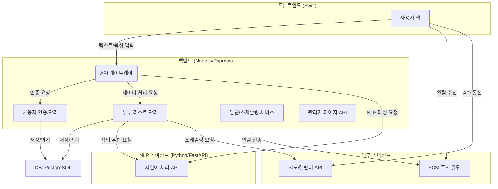

## 시스템 아키텍처

## 기술 스택
핵심 기능: 자연어 음성 입력 기반 투두 리스트 생성 및 관리
향후 기능: 투두 리스트 카테고리화, 작업 추천, 외부 API 연동 알림 기능
아키텍처: 마이크로서비스 아키텍처
### 프론트엔드 (클라이언트): iOS (Swift)
### 백엔드:
언어: Node.js (JavaScript/TypeScript)
프레임워크: Express.js
역할: 사용자 인증, 투두 리스트 데이터 관리, 외부 서비스(NLP, 지도, 캘린더) 연동, 관리자 페이지 API 제공.
### NLP 모델:
언어: Python
프레임워크: FastAPI / Flask
역할: 자연어(음성 입력 텍스트) 파싱 및 핵심 정보 추출.
### 데이터베이스: PostgreSQL (RDBMS)
 이유: 데이터의 정합성과 안정성 확보에 유리. 추후 Redis 등 캐싱용 DB 추가 고려.
알림 서비스: Firebase Cloud Messaging (FCM)
 이유: 안정적인 푸시 알림 전송.
## 업무 분장
### 백엔드 개발자
Node.js (Express) 기반의 메인 서버 개발 및 관리.
PostgreSQL 데이터베이스 설계 및 관리.
프론트엔드, 모델, 외부 서비스 간의 API 연결.
관리자 페이지 개발.
### 모델 개발자
Python (FastAPI/Flask) 기반의 NLP 모델 API 서버 구축.
자연어 파싱 모델 개발 및 성능 최적화.
향후 유사도 분석 및 추천 시스템 모델 개발.
### 프론트엔드 개발자
Swift 기반의 iOS 앱 UI/UX 개발.
백엔드 API 호출 및 데이터 시각화.
음성 입력 및 딥링크, A2A 연동 기능 구현.
FCM 연동을 통한 푸시 알림 수신 및 처리.
## 통신 방식
### 클라이언트(iOS) ↔ 백엔드(Node.js) 통신:
방법: HTTP 기반 API 통신.
기술: Swift의 URLSession 사용.
### 백엔드(Node.js) ↔ 모델(Python) 통신:
방법: 마이크로서비스 아키텍처 기반의 HTTP API 통신.
기술: Node.js에서 axios나 node-fetch로 Python 모델 서버의 API 호출.
데이터 형식: JSON