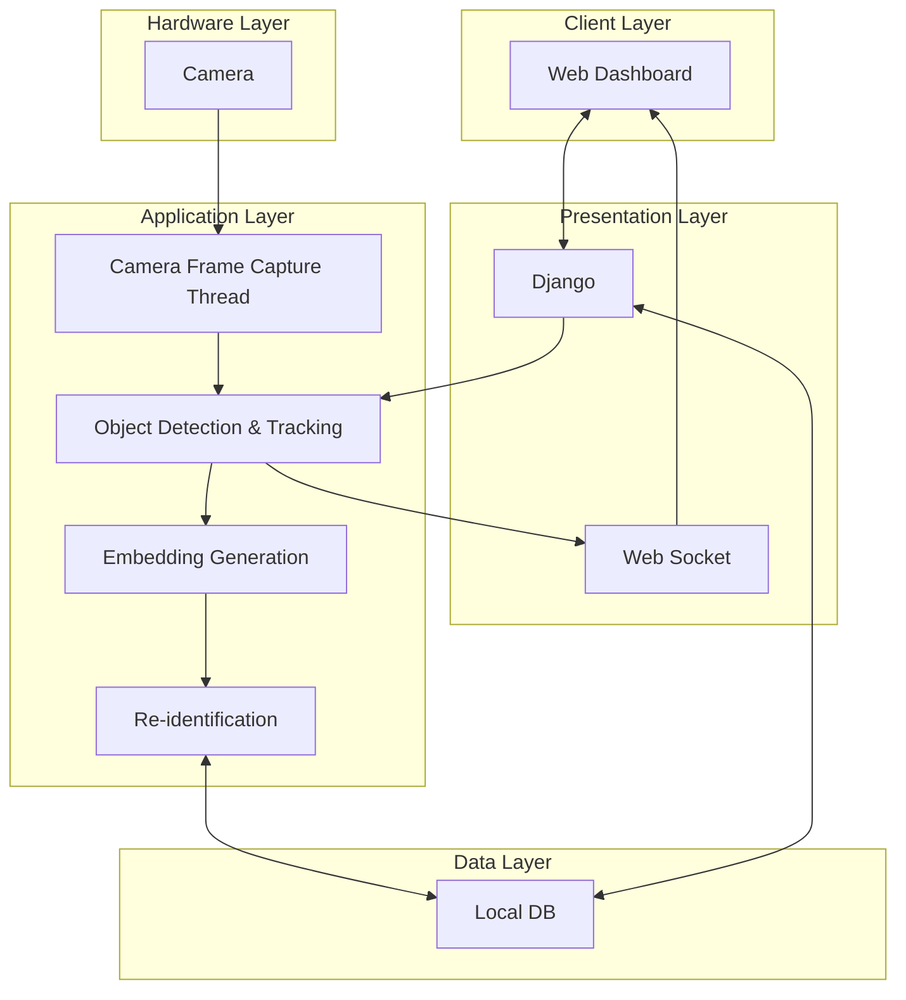

#pictag #system_architecture

```mermaid
graph TD
    subgraph "Client Layer"
        A1[Web Dashboard]
    end

    subgraph "Presentation Layer"
        B1[Django]
        B2[Web Socket]
    end

    subgraph "Application Layer"
        C0[Camera Frame Capture Thread]
        C1[Object Detection & Tracking]
        C2[Embedding Generation]
        C3[Re-identification]
    end

    subgraph "Data Layer"
        D1[Local DB]
    end
    
    subgraph "Hardware Layer"
        E1[Camera]
    end
    
    
    
    %% E1에서 C0로 영상 프레임 입력
    E1 --> C0
    
    %% C0에서 C1로 프레임 전달
    C0 --> C1
    
    %% AI 파이프라인
    C1 --> C2
    C2 --> C3
    
    %% 데이터 저장
    C3 <--> D1
    
    %% 웹 스트리밍 (AI 결과)
    C1 --> B2
    B2 --> A1
    
    %% 사용자 상호작용
    B1 --> C1  


    %% 데이터 검색
    A1 <--> B1
    B1 <--> D1
```
