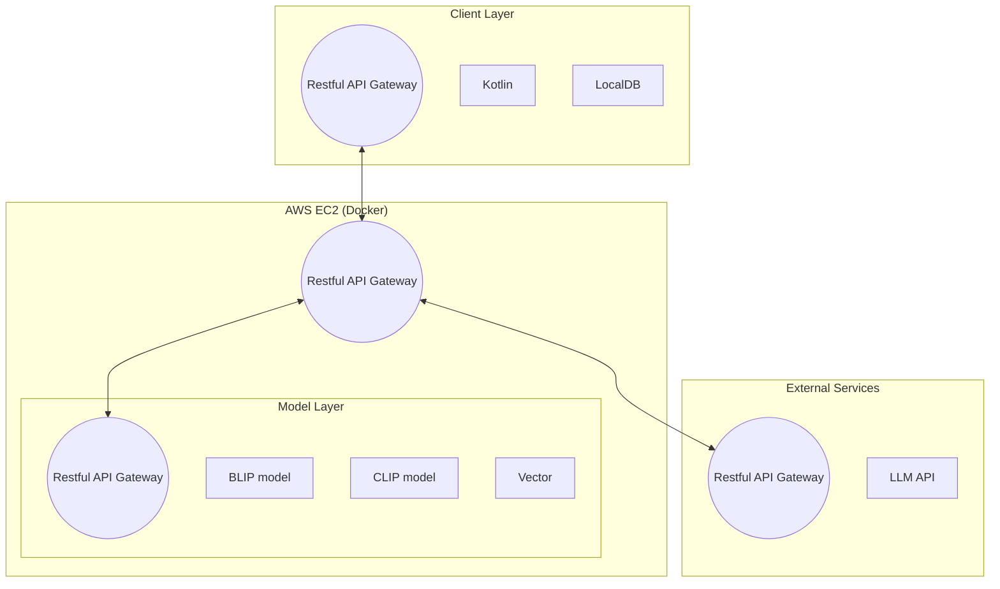

#소담일기 #시스템아키텍처 

```mermaid
graph TD
    subgraph "Client Layer"
        A0((Restful API Gateway))
        A1[Kotlin]
        A2[LocalDB]
    end
    
    subgraph "AWS EC2 (Docker)"
	    B0((Restful API Gateway))
	
	    subgraph "Model Layer"
		    C0((Restful API Gateway))
	        C2[BLIP model]
	        C3[CLIP model]
	        C4[Vector]
	    end
	end

    subgraph "External Services"
	    E0((Restful API Gateway))
        E1[LLM API]
    end
    
    %% Request-Response Flow
    A0 <--> B0
    B0 <--> C0
    B0 <--> E0    
```
