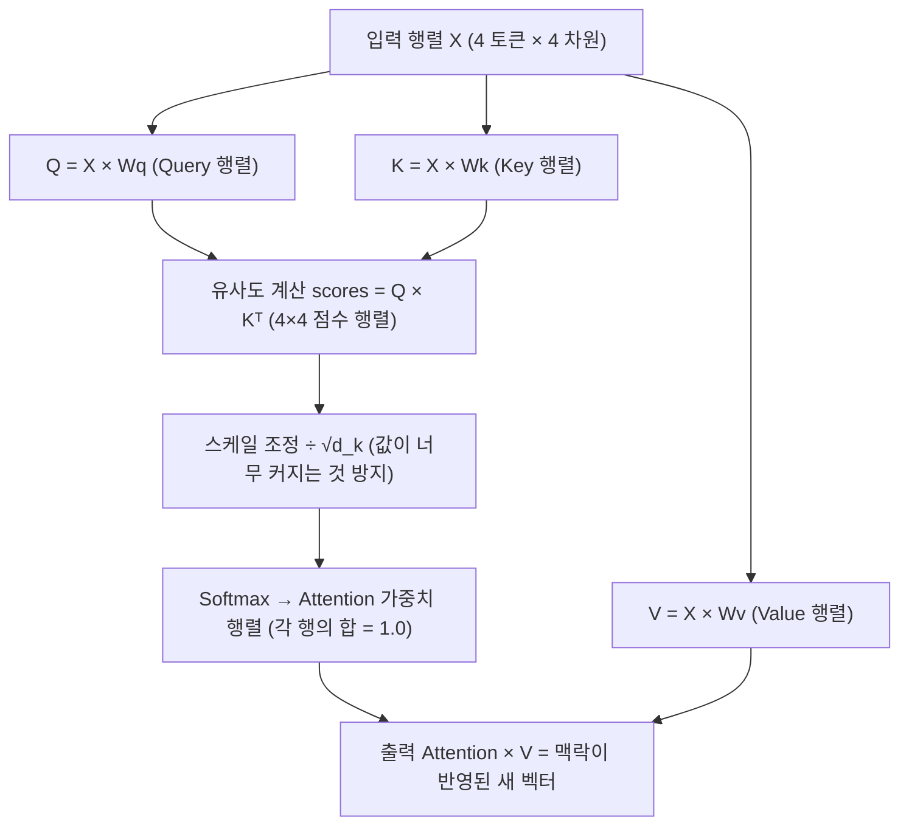

## 1. 일반 레이어의 한계

일반 Fully Connected 레이어는 입력 벡터의 각 요소를 **독립적으로**, **고정된 가중치**로 처리한다.

```
문장: "나는 은행에 갔다"

일반 레이어:
  토큰 "은행" → 항상 같은 가중치로 처리
  → "은행"이 금융 기관인지 열매인지 구분 못함
  → 주변 맥락("돈을", "낚시를")을 볼 수 없음
```

**문제**: 같은 단어도 맥락에 따라 의미가 달라지는데, 고정 가중치로는 이를 포착할 수 없다.

**Attention의 핵심 아이디어**: 가중치를 고정하지 않고 **입력 자체에서 "어디에 집중할지"를 동적으로 계산**한다.

## 2. Self-Attention의 직관

```
문장: "나는  은행에   돈을   찾았다"
       ↑     ↑       ↑      ↑
      토큰1  토큰2   토큰3  토큰4

"은행"을 처리할 때:
  → "돈을"과의 연관성 = 높음  → 더 많이 참조
  → "나는"과의 연관성 = 낮음  → 적게 참조

→ 이 "연관성 가중치"를 입력값에서 실시간으로 계산 = Attention
```

## 3. Q, K, V 의 역할

Self-Attention은 입력 각 토큰을 세 가지 역할로 변환한다.

> **전제: 토큰 → 벡터 변환 (임베딩)**
> Q/K/V를 계산하기 전에 토큰은 **임베딩 행렬(Embedding Matrix)** 을 통해 벡터로 변환된다.
> 임베딩 행렬은 `(vocab_size × d_model)` 크기의 룩업 테이블로, 학습 중 조정되고 **학습 후에는 고정**된다.
> ```
> "은행" → 토큰 ID 3842 → E[3842] = [0.21, -0.83, 0.47, ..., 0.09]  (d_model차원 벡터)
> "강"   → 토큰 ID 1201 → E[1201] = [-0.11, 0.63, -0.22, ..., 0.34]
> ```

| 역할 | 기호 | 비유 | 의미 |
|------|------|------|------|
| Query | Q | "내가 찾는 것" | 현재 토큰이 다른 토큰에게 묻는 질문 |
| Key | K | "내가 가진 것" | 각 토큰이 자신을 설명하는 식별자 |
| Value | V | "내가 줄 수 있는 정보" | 질문에 답할 때 실제로 전달하는 내용 |

> **비유**: 도서관 검색
> Query = 검색어 ("금융 기관")
> Key = 책마다 붙은 태그 ("경제", "자연", "역사" 등)
> Value = 책의 실제 내용
> → 검색어와 태그를 비교해 관련도 높은 책의 내용을 가져옴

**K, V는 해당 토큰의 임베딩에서만 결정된다:**
```
K_i = embedding_i × Wk
V_i = embedding_i × Wv
```

미래 토큰이 추가되어도 이미 계산된 K_i, V_i는 변하지 않는다. → [[kv-cache]] 재사용의 근거

## 4. Self-Attention 계산 과정

입력: 토큰 4개, 각 d_model=4 차원 벡터 (단순화)



**Step 1: Q, K, V 생성**
```
X (4, 4)  →  Q = X × Wq (4, dk)   각 토큰을 "질문 벡터"로 변환
          →  K = X × Wk (4, dk)   각 토큰을 "식별자 벡터"로 변환
          →  V = X × Wv (4, dv)   각 토큰을 "내용 벡터"로 변환

Wq, Wk, Wv 는 학습되는 가중치 행렬 (일반 레이어와 동일)
```

> **고정 vs 동적 구분**
>
> | 구성 요소 | 학습 단계 | 추론 단계 |
> |----------|----------|----------|
> | 임베딩 행렬 E | 조정됨 | **고정** |
> | Wq, Wk, Wv | 조정됨 | **고정** |
> | Attention Score (Q·Kᵀ → Softmax) | 계산됨 | **동적** — 입력 문장마다 달라짐 |
> | 최종 출력 (Score × V) | 계산됨 | **동적** — 맥락이 반영된 결과 |
>
> "동적 가중치"란 Wq/Wk/Wv가 변한다는 게 아니라, 이들로 계산된 **Attention Score가 입력마다 달라진다**는 의미다.

**Step 2: 유사도 점수 계산**
```
scores = Q × Kᵀ   →   (4, dk) × (dk, 4) = (4, 4)

scores[i][j] = i번 토큰의 Query · j번 토큰의 Key의 내적
             = "토큰 i가 토큰 j에 얼마나 주목해야 하는가"
```

**Step 3: Softmax → Attention 가중치**
```
scores ÷ √dk  →  Softmax  →  Attention 가중치 (4, 4)

각 행의 합 = 1.0 (확률 분포)

예:
"은행" 토큰의 행: [0.05, 0.10, 0.75, 0.10]
                   나는  은행에  돈을  찾았다
                               ↑ "돈을"에 75% 집중
```

**Step 4: Value 가중합 → 출력**
```
output = Attention 가중치 (4, 4) × V (4, dv) = (4, dv)

"은행" 토큰의 새 벡터 = 0.05×V[나는] + 0.10×V[은행에] + 0.75×V[돈을] + 0.10×V[찾았다]
                       ↑ 맥락이 반영된 "은행" = 금융 기관의 의미로 업데이트
```

## 5. 일반 레이어 vs Self-Attention 비교

| 항목            | 일반 FC 레이어        | Self-Attention                  |
| ------------- | ---------------- | ------------------------------- |
| 뉴런당 고정 가중치 행렬 | W 1개             | Wq, Wk, Wv, Wo = 3~4개           |
| 가중치 (추론 단계)   | 고정               | Wq/Wk/Wv 고정, Attention Score 동적 |
| 토큰 간 관계       | 없음 (독립 처리)       | 있음 (모든 토큰 쌍 비교)                 |
| 출력 차원         | 보통 축소 (압축/추출 목적) | 유지 (맥락 반영 목적 + 잔차 연결 구조)        |
| 연산 복잡도        | O(n)             | O(n) [Wq/Wk/Wv] + O(n²) [Q·Kᵀ]  |
| 맥락 반영         | 불가               | 가능                              |

```
FC의 목적 = 압축 / 특징 추출
  784 → 256 → 128 → 10   (점점 핵심만 남김)

Attention의 목적 = 맥락 반영
  [토큰4개 × 512차원] → [토큰4개 × 512차원]   (각 토큰을 더 풍부하게 업데이트)

또한 구조적 제약:
  출력 = Attention(X) + X  (잔차 연결)
  → 입출력 shape이 같아야 더할 수 있음 → 차원 유지가 필수
```

### FC vs Attention 뉴런 연결 구조

```
FC:
  토큰1의 차원들 → 토큰1의 다음 레이어 차원들   (토큰 간 연결 없음)
  토큰2의 차원들 → 토큰2의 다음 레이어 차원들   (독립 처리)

Attention:
  토큰1의 차원들  ↘
  토큰2의 차원들  →  토큰i의 다음 레이어 차원들   (모든 토큰이 기여)
  토큰i의 차원들  ↗
  토큰4의 차원들  ↗
```

추론 시 READ/WRITE 관점:
```
[READ]  토큰 i는 현재 레이어의 모든 토큰(자기 포함)의 K, V를 읽는다
[WRITE] 토큰 i의 출력은 오직 다음 레이어의 토큰 i 위치로만 전달된다
```

"Self"인 이유: 자기 자신의 K, V도 포함해서 읽는다 (자기 참조 포함).

## 연결

- [[Attention 개념 정리]] — 개요 및 탐색 허브
- [[transformer-block]] — Multi-Head Attention, 전체 구조
- [[kv-cache]] — 추론 시 K,V 재사용 최적화
