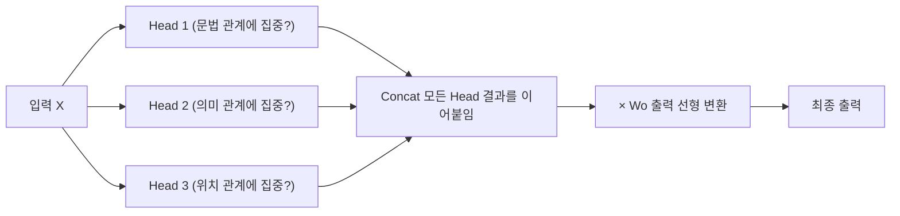
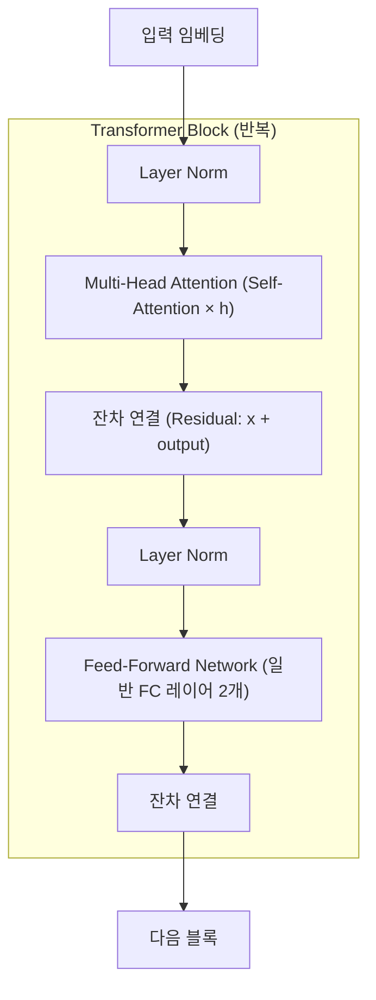

## 1. Multi-Head Attention

Self-Attention을 **h번 병렬로** 수행한다. 각 Head는 서로 다른 Wq, Wk, Wv를 사용한다.

- 각 Head가 서로 다른 "관점"에서 주목 패턴을 학습한다.
- GPT-3: 96 Heads / BERT-Base: 12 Heads
- 결과를 이어붙인(Concat) 뒤 Wo 행렬로 다시 d_model 차원으로 줄인다.

## 2. Transformer Block 전체 구조

- **FFN (Feed-Forward Network)**: 일반 레이어 2개. 토큰별 독립 처리.
- **Attention**: 토큰 간 관계 처리.
- **잔차 연결**: 입력을 출력에 더해 기울기 소실 방지.
- **Layer Norm**: 학습 안정화를 위한 정규화.
- 이 블록이 GPT-3에는 96번, BERT-Base에는 12번 쌓인다.

## 3. Attention이 Edge AI에 적용되는가?

| 모델 유형           | Attention 사용 여부 | 비고                 |
| --------------- | --------------- | ------------------ |
| CNN 기반 이상 탐지    | 불필요             | 공간 패턴만 필요          |
| LSTM 기반 예지 보전   | 선택적             | Attention 추가 가능    |
| 시계열 Transformer | 핵심              | Temporal Attention |
| LLM (텍스트 생성)    | 필수              | Self-Attention 기반  |
| 경량 Edge 모델      | 부분적             | 연산 비용으로 축소 적용      |

Edge AI에서는 Attention의 O(n²) 연산 비용이 부담되어, **Linear Attention** (근사 계산)이나 **Local Attention** (주변 토큰만 비교) 등 경량화 변형이 사용된다.

## 연결

- [[Attention 개념 정리]] — 개요 및 탐색 허브
- [[self-attention]] — Q/K/V 메커니즘, 계산 과정
- [[kv-cache]] — 추론 시 K,V 재사용 최적화
