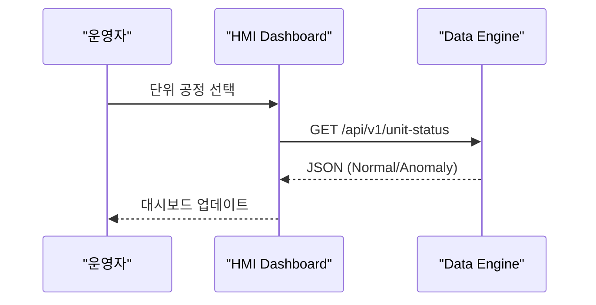
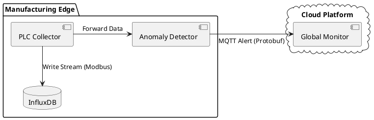
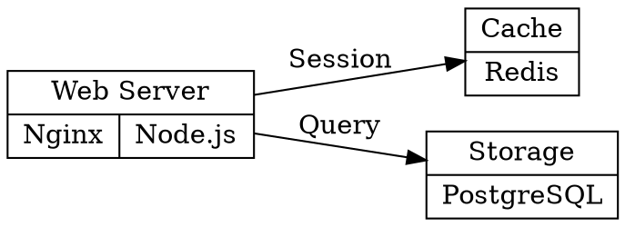

# 소프트웨어 아키텍처 시각화 도구 및 현업 표준 가이드

## 1. 개요
현대 소프트웨어 엔지니어링에서 아키텍처는 "그리는 것"이 아니라 "코드로 작성(Diagram as Code)"하는 것이 표준이다. 이는 버전 관리(Git)와 문서화의 동기화를 가능하게 한다.

## 2. 도구별 현업 활용 사례 및 예시

### 2.1 Mermaid (Modern & Web-friendly)
- **현업 위치**: GitHub, Notion, Obsidian 등의 기본 렌더러. 개발자 간의 빠른 소통에 최적화.
- **옵시디언 호환성**: **기본 지원(Native)**. 별도 설정 없이 즉시 렌더링됨.



### 2.2 PlantUML (Enterprise Standard)
- **현업 위치**: 대규모 시스템 설계의 정석. 금융, 제조, 복잡한 백엔드 아키텍처 설계 시 필수.
- **옵시디언 호환성**: **플러그인 필요**. (Community Plugin: "PlantUML") 설치 후 Server URL 설정 필요.



### 2.3 Graphviz / DOT (Infrastructure & Topology)
- **현업 위치**: 인프라 구성도 및 시스템 의존성 시각화의 최강자.
- **옵시디언 호환성**: **플러그인 필요**. (Community Plugin: "Graphviz")



### 2.4 WaveDrom (Embedded & Signal Analysis)
- **현업 위치**: 하드웨어, 반도체, IIoT 분야의 특수 표준.
- **옵시디언 호환성**: **플러그인 필요**. (Community Plugin: "WaveDrom")

```wavedrom
{ "signal": [
  { "name": "Sensor_CLK", "wave": "p......" },
  { "name": "Data_Packet", "wave": "0.45.0.", "data": ["Header", "Payload"] },
  { "name": "Interrupt",   "wave": "0..1.0." }
]}
```

---
### 2.5 D2 (Declarative Diagramming - 차세대 표준)
- **현업 위치**: PlantUML의 복잡성과 Mermaid의 단조로움을 극복한 라이징 스타.
- **옵시디언 호환성**: **플러그인 필요** (Community Plugin: "D2") 또는 Kroki 서버 활용.

```d2
direction: right
PLC: { shape: cylinder }
Edge: { shape: square }
Cloud: { shape: cloud }

PLC -> Edge: Modbus
Edge -> Cloud: MQTT
```

## 3. 도구 선택 가이드라인

| 기준 | Mermaid | PlantUML | Graphviz | WaveDrom |
| :--- | :--- | :--- | :--- | :--- |
| **가독성** | 매우 높음 | 중간 | 높음 (관계 위주) | 낮음 (전문분야) |
| **정교함** | 낮음 | 매우 높음 | 매우 높음 | 매우 높음 |
| **주요 타겟** | 웹 개발자 | 시스템 아키텍트 | 인프라 엔지니어 | 임베디드 개발자 |
| **추천 용도** | README, Notion | 공식 기술 설계서 | 네트워크 구성도 | 신호/타이밍 분석 |

---
## 4. Insight (Why don't I see the graphs?)
옵시디언은 웹 기술 기반이며 기본적으로 **Mermaid**만 기본 내장(Native Support)되어 있습니다.
- **PlantUML, Graphviz, WaveDrom**을 옵시디언에서 바로 확인하려면 **Community Plugins** 메뉴에서 각 이름에 맞는 플러그인을 설치해야 합니다.
- 만약 플러그인 설치를 원치 않으신다면, 호환성이 가장 좋은 **Mermaid**로 모든 다이어그램을 통일하는 것이 개인 지식 관리 환경에서는 유리합니다.

```d2

direction: right

vars: {

  d2-config: {

    layout-engine: elk

    theme: 200

  }

}

  

Manufacturing_Floor: {

  PLC: {

    shape: cylinder

    label: "Siemens PLC"

  }

  Sensor: "Temperature Sensor"

  PLC -> Sensor: Sampling

}

  

Edge_Gateway: {

  style: {

    fill: "#e1f5fe"

    stroke: "#01579b"

  }

  Collector: "Data Collector"

  AI_Model: "Anomaly Detector"

  Collector -> AI_Model: Stream

}

  

Cloud_Platform: {

  shape: cloud

  Dashboard: "HMI Web"

  DB: "InfluxDB"

}

  

Manufacturing_Floor.PLC -> Edge_Gateway.Collector: Modbus/TCP

Edge_Gateway.AI_Model -> Cloud_Platform.DB: Storage

Edge_Gateway.AI_Model -> Cloud_Platform.Dashboard: WebSocket Alert

```