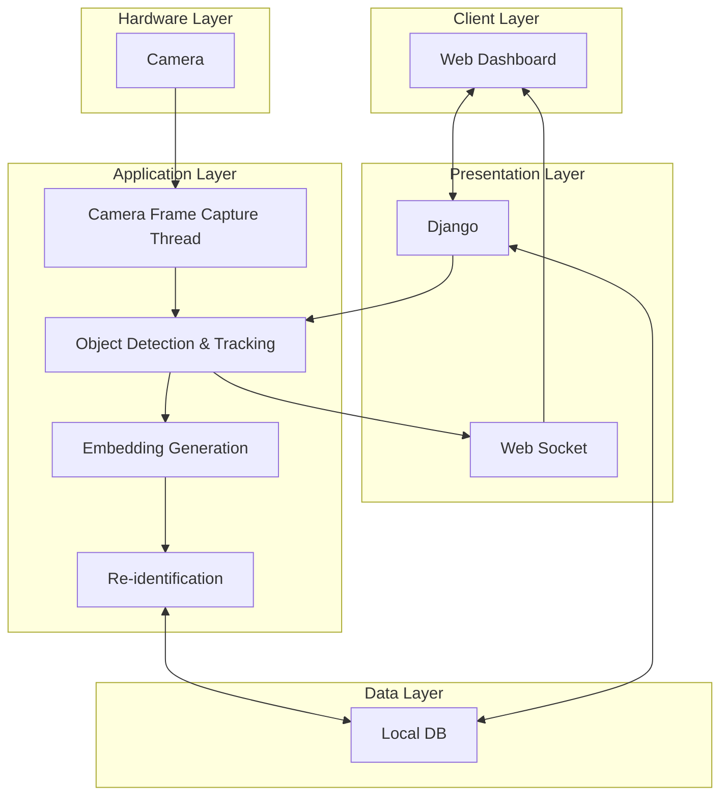

# PicTag - 소상공인 맞춤형 경량화 CCTV AI SaaS 개발
## 프로젝트 개요 및 기술 목표
PicTag 프로젝트는 소상공인을 위한 하드웨어 제약 극복형 경량화 CCTV AI SaaS 개발을 목표로 합니다. 저사양 임베디드 환경에서도 실시간 객체 탐지 및 재인식 성능을 보장하기 위해, AI 모델의 경량화와 비동기 기반 고성능 처리 파이프라인 설계를 핵심 기술 목표로 설정했습니다. 이를 통해 저비용으로 높은 수준의 인물 재인식 서비스를 제공하고, 매장 운영 효율화를 지원합니다.
## 아키텍처 및 시스템 설계
### 시스템 정의
모듈형 AI 파이프라인 설계를 통해 객체 탐지, 임베딩 생성, 재인식 로직을 분리하여 시스템의 확장성 및 재사용성을 확보했습니다. 이는 새로운 AI 모델이나 알고리즘 교체 시 메인 서비스의 중단 없이 유연하게 대응할 수 있도록 설계되었습니다.
시스템의 처리율 향상을 위해 비동기 기반 고성능 처리 파이프라인을 구축했습니다. 카메라 프레임 캡처부터 최종 재인식 결과 도출까지의 과정을 비동기 스레드 (Async Thread)로 구성하여 I/O 작업과 연산 작업을 병렬적으로 처리했습니다.
### 다중 프로토콜 기반 통신 설계
서비스 목적에 따라 다중 통신 프로토콜을 분리 적용하여 통신 독립성과 안정성을 극대화했습니다.
RTSP 프로토콜을 사용하여 카메라로부터 영상 데이터를 안정적으로 수신했습니다.
Websocket 통신을 사용하여 객체 탐지 및 재인식 결과를 Web Dashboard에 지연 없이 실시간으로 반영했습니다.
RestAPI를 사용하여 Client에서 서버로의 제어 명령이나 환경 설정 변경을 처리했습니다.
### 아키텍처 플로우 (AI 파이프라인 중심)
카메라 (Hardware Layer)로부터 RTSP 프로토콜을 통해 수신된 영상 프레임은 Camera Frame Capture Thread에서 처리됩니다. 해당 프레임은 Object Detection & Tracking 모듈로 전달되어 객체를 탐지했습니다. 탐지된 객체는 Embedding Generation 모듈에서 특징 벡터로 변환되며, 최종적으로 Re-identification 모듈에서 저장된 ID와 비교하여 인물 ID를 할당했습니다. 이 모든 과정은 후단 모델에 버퍼 방식의 데이터 전달을 적용하여 연결 효율화를 꾀했습니다.
## 핵심 기능
### 재인식 알고리즘 개발 및 학습 고도화
한국인 재식별 이미지 데이터셋을 증강 처리 (argumentation) 기법을 통해 학습 데이터의 다양성을 확보하고 AI 모델의 일반화 성능을 고도화했습니다.
학습 효율을 극대화하기 위해 계통 샘플링 (systematic sampling) 기법을 적용하여 데이터셋을 필터링하였으며, 이를 통해 전체 학습 효율을 50% 이상 개선했습니다.
동일 인물에 대한 유사도 값과 다른 인물에 대한 유사도 값의 차이를 분석하여 최적의 기준값 (Threshold)을 설정하고 ID를 할당하는 로직을 구현했습니다.
### 실시간 객체 탐지 및 대시보드 통합
RTSP 프로토콜로 수신된 스트리밍 데이터를 Camera Frame Capture 스레드에서 처리하고, Django 기반 Presentation Layer와 Websocket 통신을 연결하여 실시간으로 객체 탐지 결과를 Web Dashboard에 반영했습니다.
AI 파이프라인 (Object Detection, Tracking) 후단 모델로 데이터를 전달할 때 버퍼 방식을 사용하여 데이터 병목 현상을 관리하고 시스템의 처리율을 높였습니다.
### 모델 경량화 및 보안성 확보
Yolo 모델의 백본을 분해 (Backbone Decomposition)하여 재인식 알고리즘에 필수적인 부분만 발췌하고 재사용하여 모델의 경량화를 달성했습니다. 이는 저사양 환경에서의 구동 제약을 극복하기 위한 핵심 전략이었습니다.
익명화 알고리즘을 적용하여 개인 정보를 보호하며, 탐지 및 재인식 데이터를 로컬 DB에만 저장하도록 설계하여 외부 공격에 대한 보안성을 확보했습니다.
## 문제 해결 및 성능 최적화
### 알고리즘 최적화를 통한 데이터 병목 현상 해결
초기 재인식 알고리즘 설계 시 데이터 처리 과정에서 병목 현상이 발생할 가능성이 높아, 처리 속도 개선이 필요했습니다.
Yolo 백본 분해 후, 성능 향상을 위해 특징 추출 (Feature Extraction) 알고리즘을 Linear $\to$ Pooling $\to$ Attention 순으로 비교 분석했습니다.
최종적으로 Attention 알고리즘을 선택했습니다. 이 알고리즘은 모든 은닉 상태 벡터에 가중치 (Attention Score)를 부여하고, 이를 기반으로 매 순간 새로운 벡터를 생성하는 방식으로 데이터의 병목 현상을 효과적으로 해결하고 재인식 정확도를 개선했습니다.
동일 인물에 대한 유사도와 다른 인물에 대한 유사도 값의 차이를 기준값으로 하여 ID를 할당하는 로직을 적용했습니다.
### 검증 완료 모델의 추가 경량화
검증이 완료된 AI 모델의 추가적인 경량화 및 최종 응답 속도 향상을 위하여 Intel OpenVINO Toolkit을 이용하여 모델 최적화 (Model Optimization)를 수행했습니다.
모델 매개변수 (Parameter)의 세부 조정을 통해 모델의 크기는 줄이면서도 정확도 (Accuracy)의 저하를 최소화하는 작업을 병행했습니다.
## 회고
### 학습 및 기술적 도전
프로젝트를 수행하는 과정에서 RTSP 통신, Websocket 기반 실시간 통신 등 다양한 프로토콜을 구현하고, Yolo 백본 분해, OpenVINO와 같은 고난도 기술적 해법을 찾아내며 미지의 기술에 대한 도전 정신과 실제 사용 환경을 고려하는 솔루션 설계 역량을 확보했습니다.
특히, 하드웨어 제약 조건 하에서 성능을 최적화하기 위해 실시간 처리 파이프라인을 설계한 경험은 실제 사용 환경을 고려하는 솔루션 설계 역량을 확보하는 데 기여했습니다.
### 아쉬움과 개선 방향
향후 프로젝트에서는 초기 모델의 성능과 정확도 검증을 더욱 체계적으로 수행하여 모델의 실질적인 현업 적용 가능성을 높일 계획입니다.
복잡한 시스템 구조를 다루면서 발생할 수 있는 잠재적 버그를 최소화하기 위해, 테스트 자동화 및 CI/CD 파이프라인을 구축하는 것을 다음 목표로 설정합니다.
## 그래프
### 01

